# ECRC - Características

En esta aplicación se parametrizan todas las características que se vayan a utlizar en el módulo de salud, por ejemplo, al identificar en la afiliación si un usuario pertenece a un grupo étnico.  

>+ [Prestaciones Economicas CauseIdELIP](http://docs.oasiscom.com/Operacion/is/salud/ebasica/ecrc#prestaciones-economicas-causeidelip)
>+ [Parametrización de formularios de salud a nivel jerarquíco](http://docs.oasiscom.com/Operacion/is/salud/ebasica/ecrc#parametrización-de-formularios-de-salud-a-nivel-jerarquíco)

En el maestro agregamos un nuevo renglón, asignamos un número de característica, el nombre de esta característica y el nombre del campo donde se reflejará.  

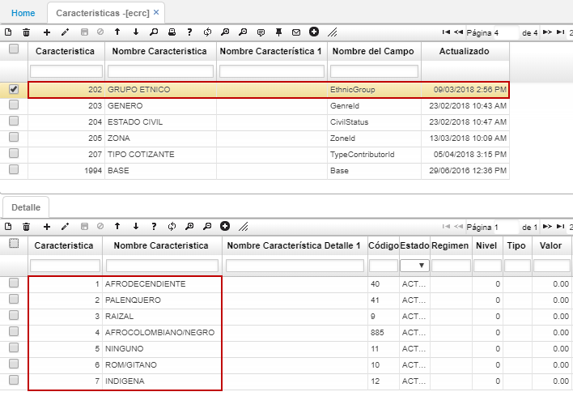

En el detalle, ingresaremos las opciones a elegir que contiene la característica del maestro. El campo _Estado_ permite visualizar los registros que se encuentran en estado activo e inactivar los que no se necesitan  sin perder la trazabilidad.  

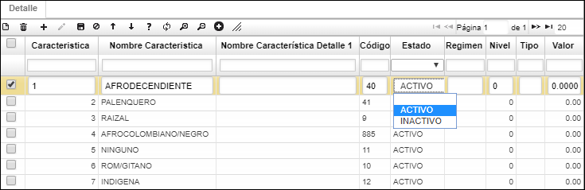   

## [Prestaciones Economicas CauseIdELIP](http://docs.oasiscom.com/Operacion/is/salud/ebasica/ecrc#prestaciones-economicas-causeidelip)

En la aplicación **ECRC** se tienen controles de validación de fechas, relación laboral y proceso que son parametrizados en el campo *CauseIdELIP.* 

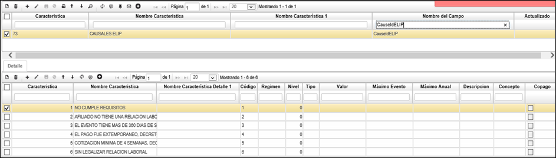

Este control se ve reflejado en el campo Id Causa. 

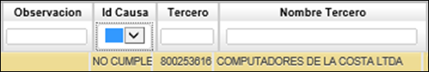

Con su respectiva lista en este campo.

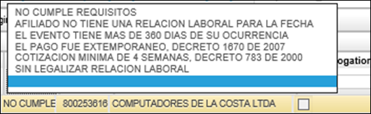

Cuando el proceso de confirmación finaliza sin novedades, se crea un movimiento de cuentas por pagar.

## [Parametrización de formularios de salud a nivel jerarquíco](http://docs.oasiscom.com/Operacion/is/salud/ebasica/ecrc#parametrización-de-formularios-de-salud-a-nivel-jerarquíco)

* Desde características **ECRC**, se limiten por documento, concepto y motivo, esto para el tema de afiliaciones en contributivo y subsidiado, se adiciona control por tipo lista.  

**Características**.  

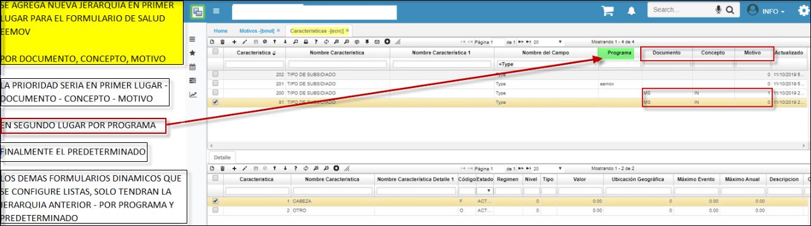  

* Parametrizacion del motivo [**BMOT:**](http://docs.oasiscom.com/Operacion/common/bsistema/bmot)  

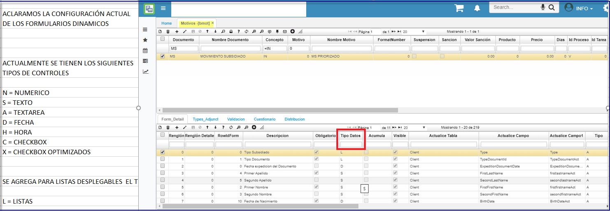  
* Jerarquía.  

  

Se realiza prueba en programa [**EEMOV**](http://docs.oasiscom.com/Operacion/crm/portal/cliente/eemov)  
Generamos el detalle del [**EEMOV**](http://docs.oasiscom.com/Operacion/crm/portal/cliente/eemov)  

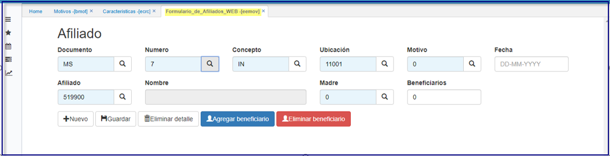  

Generamos el detalle del [**EEMOV**.](http://docs.oasiscom.com/Operacion/crm/portal/cliente/eemov)  

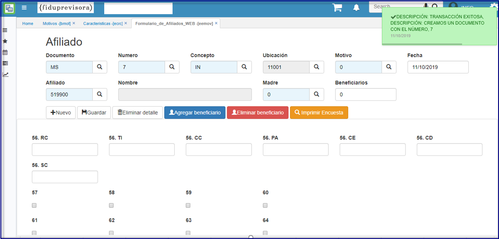  

Visualizamos que se cargan los datos configurados para el formulario.  
Anteriormente los campos resaltados estan como zoom.  
Al modificarle la configuración se carga a modo lista como se puede confirmar.  

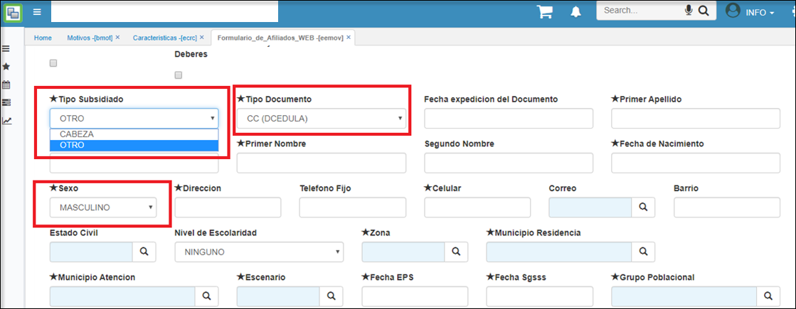  

Realizamos la prueba de grabación.   
Ingresamos los datos para el formulario.   
Se comprueba que se realiza la grabación de manera correcta.   

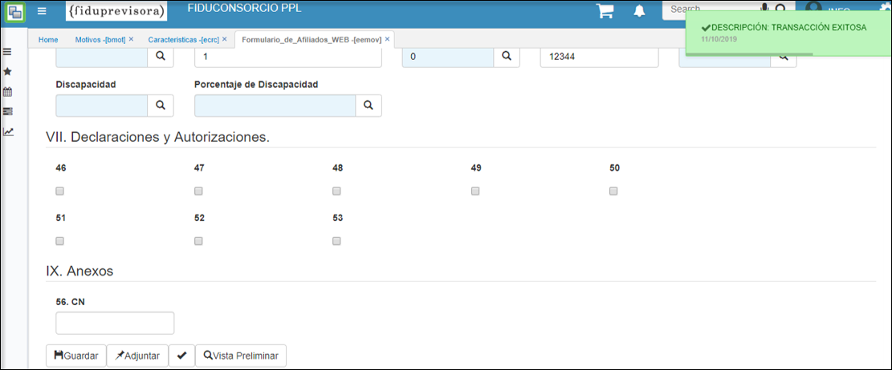  

Se confirma los datos guardados de manera correcta ingresando al programa *EMOV.*   
Filtramos los campos tipo lista.   
Podemos confirmar que el proceso se genera de manera correcta.   

 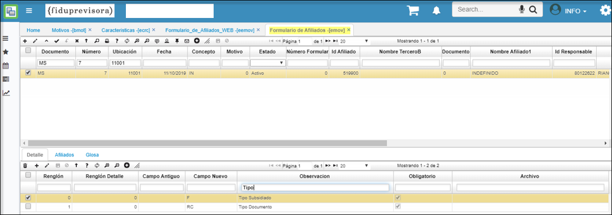  

