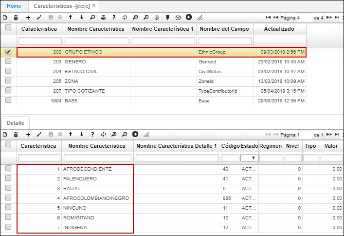
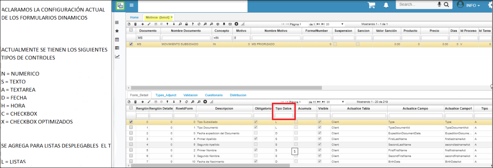
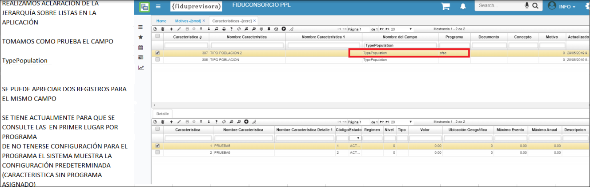
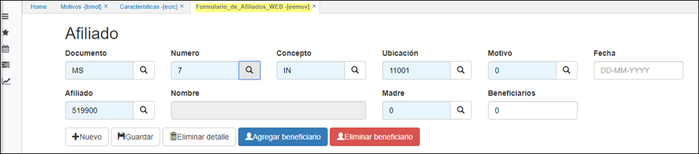

# ECRC - Características

En esta aplicación se parametrizan todas las características que se vayan a utlizar en el módulo de salud, por ejemplo, al identificar en la afiliación si un usuario pertenece a un grupo étnico.  

En el maestro agregamos un nuevo renglón, asignamos un número de característica, el nombre de esta característica y el nombre del campo donde se reflejará.  

En el detalle, ingresaremos las opciones a elegir que contiene la característica del maestro. El campo _Estado_ permite visualizar los registros que se encuentran en estado activo e inactivar los que no se necesitan  sin perder la trazabilidad.  

  

*****

** Parametrización de formularios de salud o programas tipo formulario**:  
* Desde características  [ECRC], se limiten por documento, concepto y motivo, esto para el tema de afiliaciones en contributivo y subsidiado, se adiciona control por tipo lista.  
**Características**.  

  

* Parametrizacion del motivo **BMOT:**  

  
* Jerarquía.  

  

Se realiza prueba en programa **EEMOV**  
Generamos el detalle del **EEMOV**.  

  

