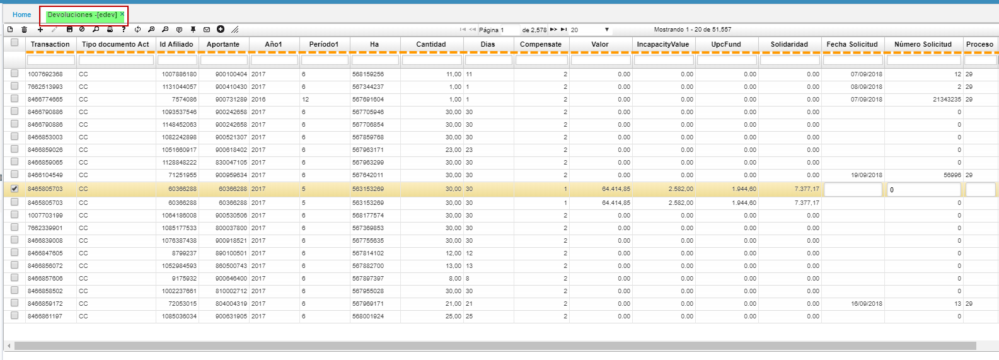

# EDEV - Devoluciones

En esta aplicación se parametrizan todas las características que se vayan a utlizar en el módulo de salud, por ejemplo, al identificar en la afiliación si un usuario pertenece a un grupo étnico.  

En el maestro agregamos un nuevo renglón, asignamos un número de característica, el nombre de esta característica y el nombre del campo donde se reflejará.

**Transaccion:**
**Tipo de Documento:**
**Id Afiliado:**
**Aportante:**
**Año1:**
**Periodo:**
**Ha:**
**Cantidad:**
**Dias:**
**Compensate:**
**Valor:**
**Incapacidad valor:**
**UpcFund:**
**Solidaridad:**
**Fecha Solicitud:**
**Numero de Solicitud:**
**Proceso:**

