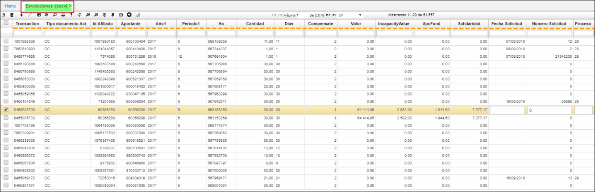

# EDEV - Devoluciones

Esta aplicacion hace parte del proceso de salud 2.5 y 2.8, en donde se valida si el afiliado cumple la parte de cotización; para analizar y resolver si se hace devolucion.
En esta vista **[EDEV]** se reflejarán datos emitidos del [ELIQ] Liquidacion.  

Se visualizan campos comoS emitidos de la liquidacion [ELIQ]:

* **Transaccion:**
* **Tipo de Documento:**
* **Id Afiliado:**
* **Aportante:**
* **Año1:**
* **Periodo1:**
* **Ha:**
* **Cantidad:**
* **Dias:**
* **Compensate:**
* **Valor:**
* **Incapacidad valor:**
* **UpcFund:**
* **Solidaridad:**
* **Fecha Solicitud:**
* **Numero de Solicitud:**
* **Proceso:**
* La aplicación ELIQ permite ver la información de los archivos planos del operador y del banco cargados anteriormente en la aplicación BINT - Interfaces. Al cargar los documentos en BINT, se crearán automáticamente en ELIQ - Liquidaciones los documentos PO - Planilla Operador para el archivo del Operador y los documentos PB - Pago Banco para el archivo plano enviado por el banco.  
