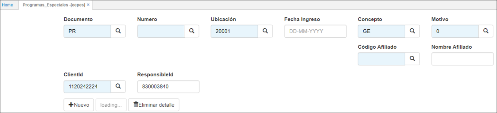
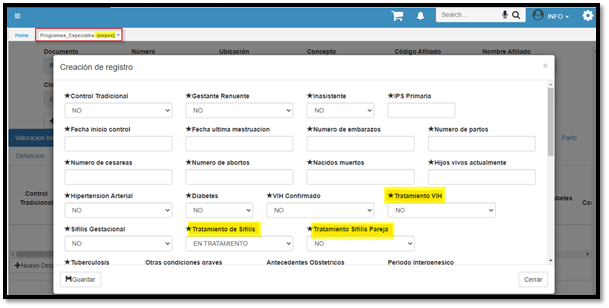
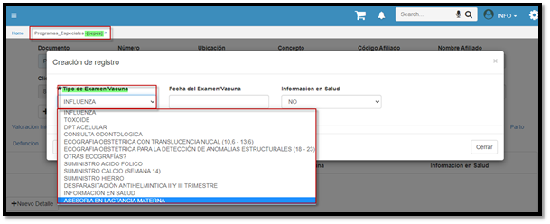
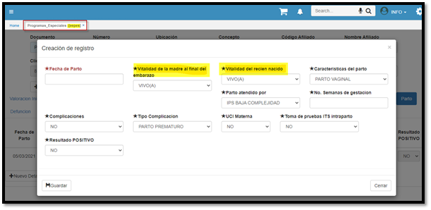
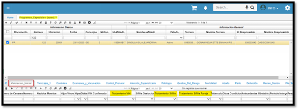
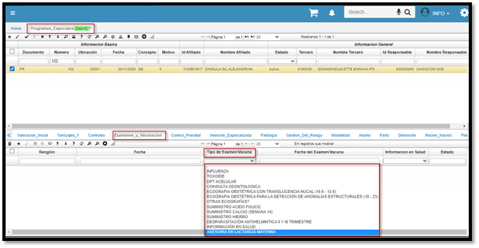

---
layout: default  
title:Programas Especiales   
permalink: /Operacion/is/salud/ebasica/eepes  
editable: si  
---  

# EEPES -  Programas Especiales  

Aplicación creada priincipalmente con el objetivo de poder llevar un registro de la madres gestantes, en las cuales se les parametriza todos sus datos y a nivel de detalle se incursiona mas a fondo sobre temas mas relevantes.    

  

Se modifican las opciones **EPES y EPES**, de la siguiente manera:  
1. Tratamiento de sífilis, debe ir dentro de valoración inicial, opciones: en tratamiento, no tratada, finalizado.  
2. Tratamiento de sífilis pareja, debe ir dentro de valoración inicial, opciones: si / no .  
3. Tratamiento VIH, debe ir dentro de valoración inicial, opciones: si / no .  
4. Asesoría en lactancia materna, debe ir dentro de exámenes y vacunación, opciones: si / no .  
5. Vitalidad de la madre al final del embarazo, debe ir dentro de parto, opciones: viva/ muerta.  
6. Vitalidad del recién nacido, debe ir dentro de parto, opciones: vivo/ muerto.  

*****

* Campos nuevos EEPES - Valoracion inicial  

  

* Examen nuevo -EEPES tab exámenes.  

  

* Campos nuevos - EEPES tab Parto.  

  

## EPES  
* Campos nuevos EPES  tab Valoración inicial.  

  

* Examen nuevo EPES - tab Exámenes.  

  

