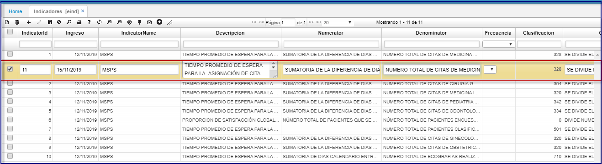
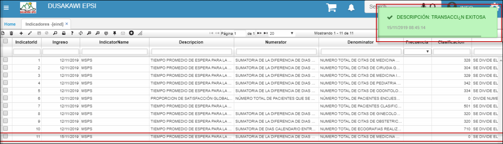

---
layout: default  
title: INDICADORES   
permalink: /Operacion/is/salud/ebasica/eind  
editable: si  
---  

# EIND - INDICADORES   

La opcion **EIND** es para crear los indicadores para Gestión del Riesgo, Evaluación de Efectividad solicitados por los entes de Control. En los módulos EMED y EEMED se diligencian dichos indicadores   
Se crea la opción:  Indicadores **[EIND]** para el módulo de salud.  

   

Al guardar.  
 
  

