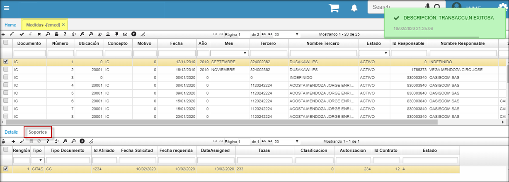

---
layout: default  
title: Medidas  
permalink: /Operacion/is/salud/ebasica/emed  
editable: si  
---  

# EMED -  Medidas  

Programa de salud, implementado para las medidas y controles,  ejemplo los numeros de recien nacidos, de gestantes etc, estos son por algunos indicadores de **Ips o Eps**, en los cuales tiene la propiedad de que los unicos campos editables son: numerator y Denominator, ya en la columna valor es un campo que sera calculado por medio de un procedimiento que se configurara mas adelante.    

  

* Se crea nueva pestaña para la opción Medidas **[EMED]** en le módulo de salud, denominada **Soportes** para visualizar registros nominales que deben soportar algunos indicadores y cuya carga se realiza desde la interface.  

  

# Circular 019.  

En la aplicación **EMED** se crean las medidas y mediante la vista v_Circular019 y el BINT 32 se realiza la salida en formato XLS.  

*****

