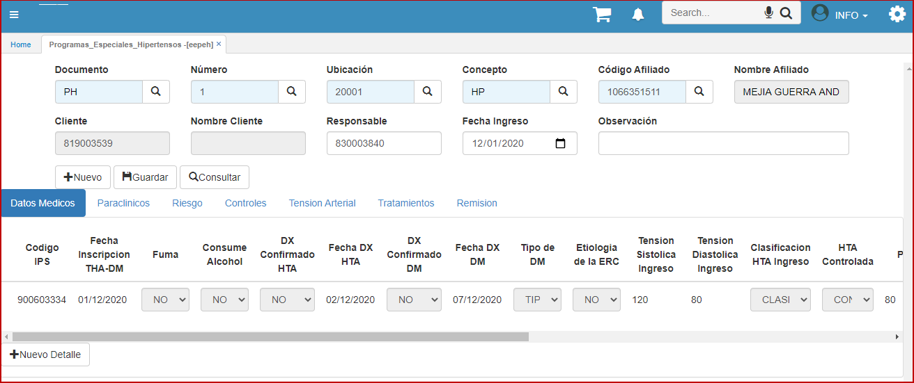

---
layout: default  
title: Hipertensos   
permalink: /Operacion/is/salud/ebasica/epeh  
editable: si  
---  

# EPEH -  Hipertensos  

Hipertensos. Se crean las opciones EPEH y EEPEH previa parametrización en SPRO.  Se crea el documento PH para ser manejado en las opciones creadas.  Se traslada la parametrización de conceptos y motivos al documento nuevo PH para Hipertensos    

  
