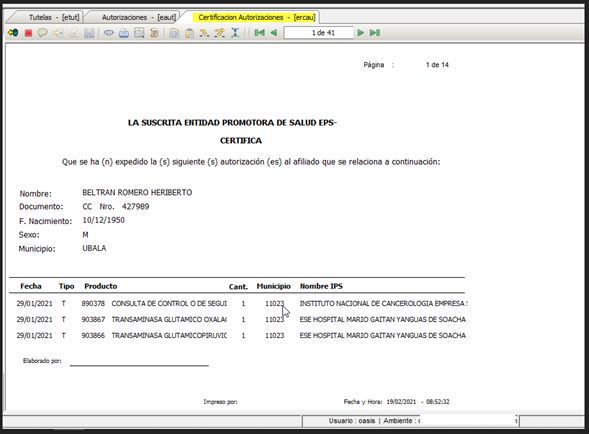

# ERCAU - Certificación Autorizaciones  

Por medio del cual, la entidad promotora de salud expide y/o certifica, autoriza al afiliado; detallando producto(s), Municipio, Nombre de la IPS.   
**Certificación Autorizaciones**.  

  

