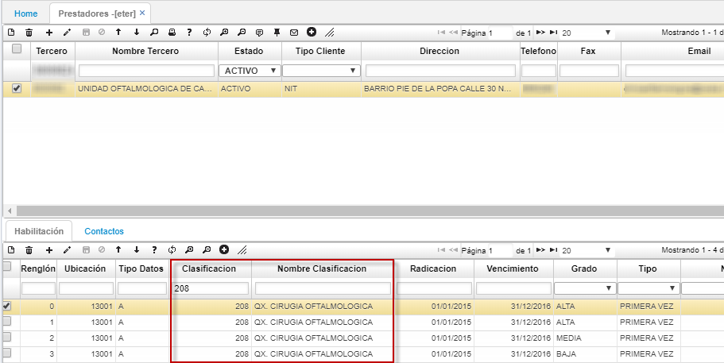
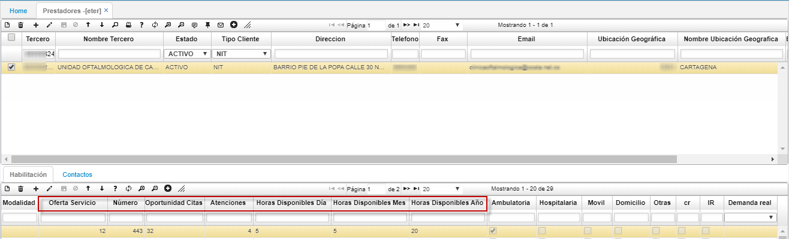

# **ETER** - Prestadores  

Adición de campos informativos del prestador (IPS), para que la EPS tenga mayor conocimiento de la capacidad instalada.

En la parte superior se encuentran los datos de registro del tercero (en este caso la IPS)

los datos resaltados a continuación hacen referencia a la capacidad instalada del tercero(IPS) por cada **Nombre de Clasificación** (caracteristica)

1. Oferta de Servicio  
2. Número
3. Oportunidad de Citas
4. Atenciones:
5. Horas Disponibles Día:
6. Horas Disponibles Mes:
7. Horas Disponibles Año:

