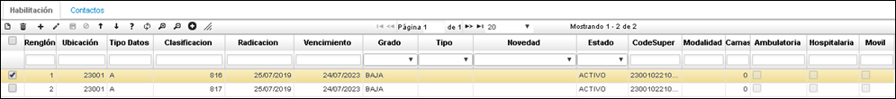

# **ETER** - Prestadores  

>+ [Detalle de la aplicación ETER - Prestadores](http://docs.oasiscom.com/Operacion/is/salud/ecntpre/conpre/eter#detalle-de-la-aplicación-eter---prestadores)

La aplicación **ETER - Prestadores,** nos muestra sugerencias de servicios que tiene habilitado el prestador.

**Tercero:** Seleccionar del zoom el tercero con quien se realiza la prestación del servicio.
**Tipo Cliente:** Seleccionar tipo de documento de identificación. 
**Ubicación geográfica:** Código de la ciudad donde está ubicado el prestador.

Cuando se crea este documento, queda activo, luego se llena la información y finalmente se debe Procesar. 

## [Detalle de la aplicación ETER - Prestadores](http://docs.oasiscom.com/Operacion/is/salud/ecntpre/conpre/eter#detalle-de-la-aplicación-eter---prestadores)

En la parte inferior, en el *Detalle,* se encuentran las pestañas *Habilitación y Contactos;* la pestaña habilitación son los servicios habilitados del prestador ante el Reps (Registro Especial de Prestadores de servicios de salud) y en la pestaña contactos, se pueden encontrar datos de las personas a quienes se puede contactar en esas entidades. 

