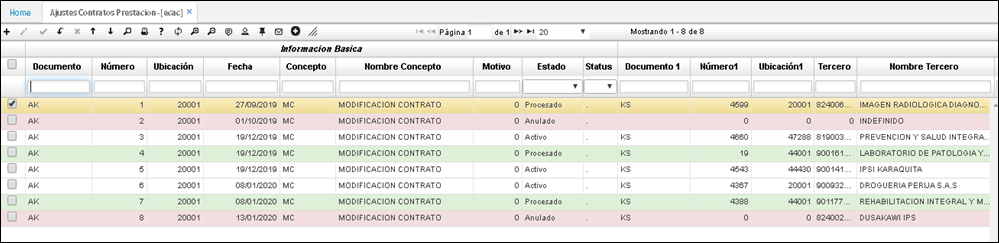
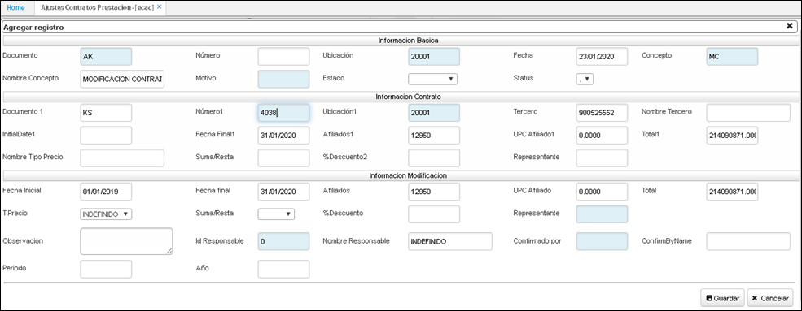
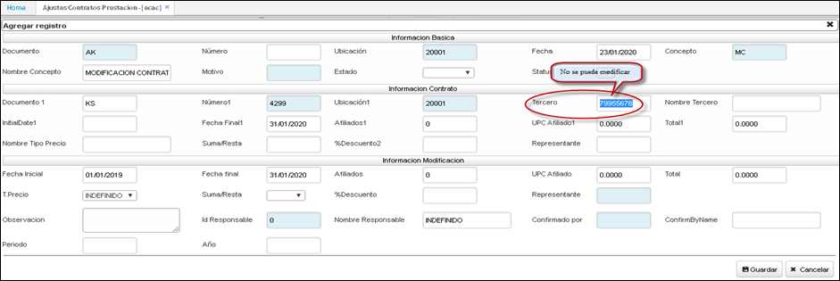
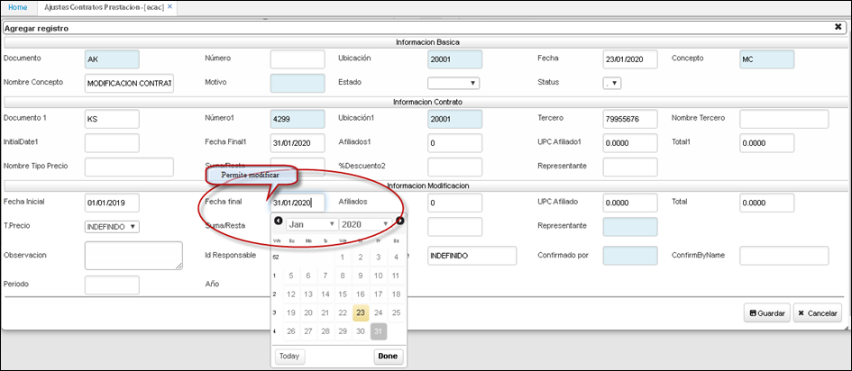
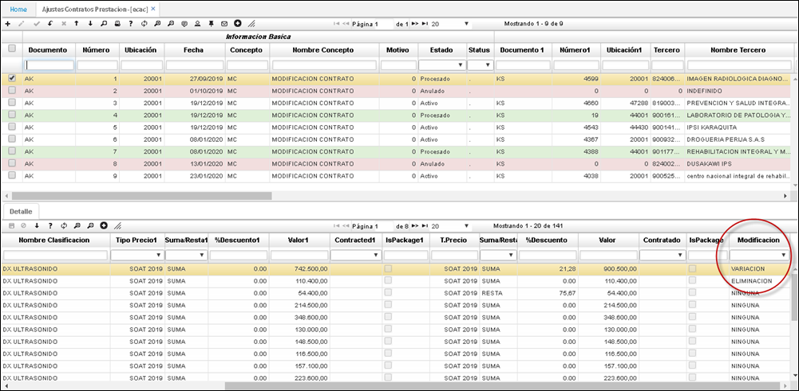

# ECAC - Ajustes contratos prestación

>+ [Detalle de la aplicación ECAC – Ajustes Contratos Prestación](http://docs.oasiscom.com/Operacion/is/salud/ecntpre/movpre/ecac#detalle-de-la-aplicación-ecac---ajustes-contratos-prestación)

Este manual le explica cómo realizar múltiples modificaciones al contrato.  Sirve tanto para régimen contributivo como para régimen subsidiado.  La aplicación que se utiliza para hacer los ajustes a los Contratos es **ECAC – Ajustes Contratos Prestación.**

Para realizar el proceso de ajuste a los contratos de prestación, se debe ingresar a la aplicación **ECAC,** allí se deberá crear un nuevo registro. 

Para crear un nuevo registro, damos clic en el botón + (Agregar nueva fila) del maestro y diligenciamos el formulario.

**Documento:**  AK de Ajuste a Contrato.
**Ubicación:** desde donde se realiza el ajuste al contrato.
**Concepto:** **MC** de Modificación Contrato.
**Número 1:** Se busca el número del contrato.

Hay dos secciones en el formulario: 

*“Información del contrato”:* esta información no se puede modificar.
*“Información Modificación”:* esta información se puede modificar según los ajustes que se requiera.

## Detalle de la aplicación ECAC – Ajustes Contratos Prestación

En la parte inferior, en la pestaña _**Detalle,**_ hay una columna que se llama modificación.  Si se le va a hacer una variación al valor, se le da guardar. En Modificación, se le dice cuál es la variación que se le hace: adición, eliminación, variación.

