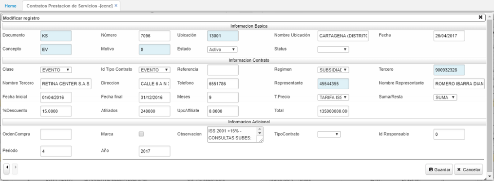
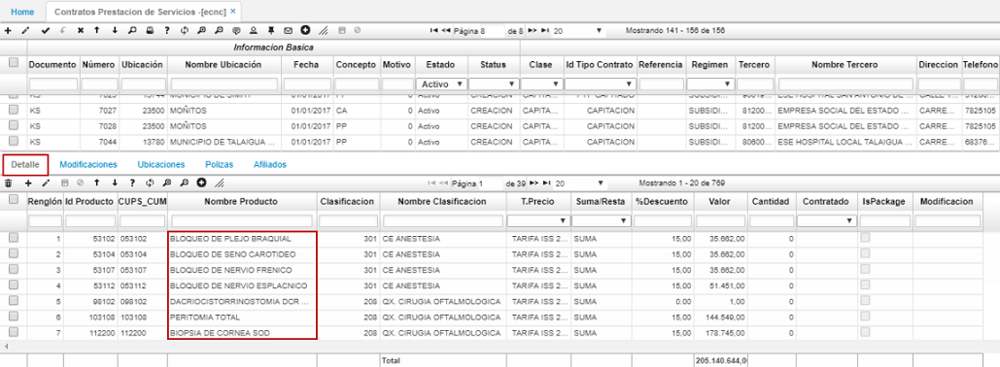

# ECNC - Contratos prestación de servicios

>+ [Detalle de la aplicación ECNC – Contratos Prestación de Servicios](http://docs.oasiscom.com/Operacion/is/salud/ecntpre/movpre/ecnc#detalle-de-la-aplicación-ecnc---contratos-prestación-de-servicios)

Este manual le explica cómo crear nuevos contratos de prestación de servicios.  Sirve tanto para régimen contributivo como para régimen subsidiado.  La aplicación que se utiliza para la creación de los Contratos es **ECNC.**  Como complemento a esta, se encuentra la aplicación [**ETER,**]() la cual muestra una sugerencia de los servicios que tiene habilitado el Prestador.

Para realizar el proceso de creación de contratos de prestación de servicios, se debe ingresar a la aplicación **ECNC,** allí se deberá crear un nuevo registro

Para ingresar un nuevo contrato damos click en el botón **+** _(Agregar nueva fila)_ del maestro y diligenciamos el formulario.  

**Documento:** seleccionar del zoom el documento a realizar.  Si es para el régimen subsidiado, el documento es _**KS;**_ Si es para el régimen contributivo, el documento es _**KC.**_
**Ubicación:** seleccionar del zoom la ubicación donde se realiza el contrato.
**Fecha:** indicar la fecha en la cual se registra el contrato.
**Concepto:** seleccionar el concepto por el cual se registra el contrato.

Seguidamente, ingresamos la información del contrato.

**Clase:** Seleccionar la clase de servicio contratado. *(Evento, Capitado, PGP - Presupuesto Global).*
**Id Tipo Contrato:** seleccionar de la lista el tipo de contrato que registra. (PYP EVENTO, PYP CAPITADO, CAPITACIÓN, EVENTO).
**Referencia:** ingresar la verificación de los datos del contrato.
**Régimen:** seleccionar *Contributivo o Subsidiado.*
**Tercero:** seleccionar del zoom el tercero con quien se realiza el contrato.
**Representante:** seleccionar del zoom el número de identificación del representante del contrato.
**Fecha inicial y final:** indicar la fecha inicial del contrato y la fecha en que termina.
**Tipo Precio:** seleccionar de la lista el tipo de precio que aplica al contrato.
**%Descuento:** si el contrato tiene un porcentaje de descuento, ingresar en dígitos.
**Afiliados:** ingresar la cantidad de afiliados.

Ingresados los datos, damos clic en el botón **Guardar.**

## [Detalle de la aplicación ECNC – Contratos Prestación de Servicios](http://docs.oasiscom.com/Operacion/is/salud/ecntpre/movpre/ecnc#detalle-de-la-aplicación-ecnc---contratos-prestación-de-servicios)

En la parte inferior, en la pestaña **_Detalle_** ingresamos todos los servicios habilitados  con  el prestador. Se ingresa la clasificación del servicio y el tipo de precio que se va a manejar para cada servicio, junto al porcentaje de descuento si aplica y el Valor.  

En la pestaña **Modificaciones** se pueden ver todos los ajustes realizados al contrato desde la aplicación _ECAC - Ajustes Contratos Prestación_.  

En la pestaña **Ubicaciones** se agregan todos los municipios a los que cubrirá con sus servicios el contrato.  

En la pestaña **Pólizas** se ingresa la información de la póliza del contrato de prestación de servicios en caso de presentarse.  
