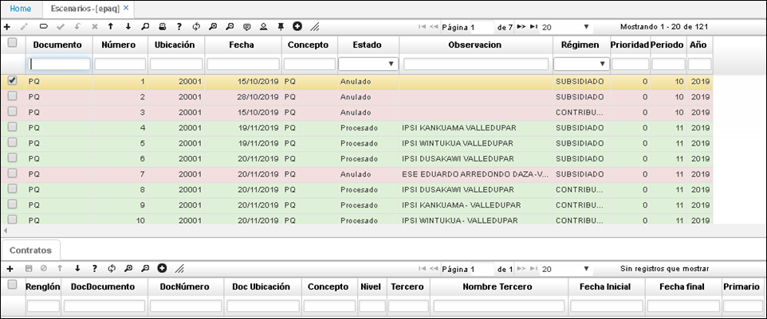

# EPAQ - Reclutamiento de Escenarios

>+ [Detalle de la aplicación EPAQ - Escenarios](http://docs.oasiscom.com/Operacion/is/salud/ecntpre/movpre/epaq#detalle-de-la-aplicación-epaq---escenarios)

En este Manual, se explica que son escenarios (paquetes), es decir los múltiples contratos que tiene la EPS con las instituciones o personas que pueden atender a sus afiliados, la aplicación en la que se pueden enlazar y la forma de hacerlo.

Para realizar el proceso de creación y asignación de paquetes, se debe ingresar a la aplicación **EPAQ - Escenarios,** allí se deberán enlazar a la EPS los diferentes contratos o escenarios donde se puede atender a los afiliados.  Funciona tanto para régimen Subsidiado como para régimen Contributivo.  En el maestro se especifica la IPS y en el detalle, el paquete de contratos.

Cuando se da clic en adicionar registro +, se escoge el régimen:

## [Detalle de la aplicación EPAQ - Escenarios](http://docs.oasiscom.com/Operacion/is/salud/ecntpre/movpre/epaq#detalle-de-la-aplicación-epaq---escenarios)

Dentro del detalle se debe especificar una sola IPS primaria o principal y se debe confirmar.  Dentro de esa EPS, se muestran todos los lugares donde se puede atender al afiliado, o sea, los diferentes contratos que existen con esa EPS que fueron creados en la aplicación ECNC.  Los contratos se enlazan a la EPS. Se seleccionan cuales contratos y cuál es la IPS primaria, posteriormente, se debe procesar el registro.

Cuando se realiza el formulario de afiliación a través de la aplicación [**EEMOV,**](http://docs.oasiscom.com/Operacion/crm/portal/cliente/eemov) se le asigna el escenario: 

