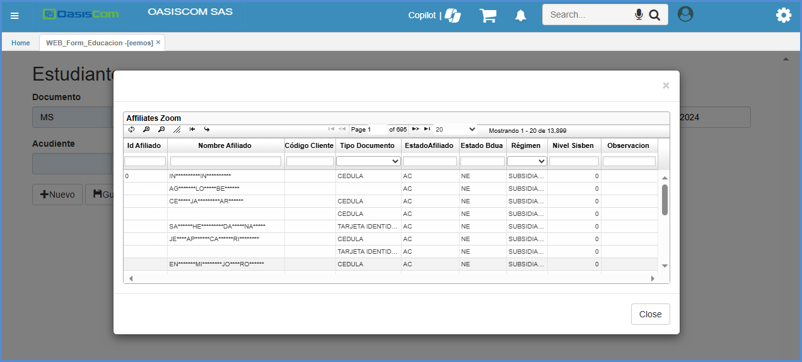

# EEMOS Y EMOS

**EEMOS – Formulario de Educación** y **EMOS- Formulario Estudiantes**

Botones a visualizar en la aplicación: 

| **Botones** | **Descripción** |
| --- | ----------- |
|  | Guardar el formato diligenciado de los estudiantes |
|  | Adjuntar archivos necesarios para el proceso (Ejemplo: Fotocopias solicitadas para el proceso de matrícula)|
| | Procesar el formulario.|
|  | Con este botón se puede ver el contrato de matrícula de manera grafica.|
|  | Crear un nuevo registro.|
|  | Guardar la creación del estudiante.|
| | Eliminar la creación del estudiante para diligenciar uno nuevo.  |
|  | Agregar un nuevo estudiante para el registro.|
| | Eliminar el estudiante en el registro. |

La aplicación **EEMOS - Formulario de Educación** es con el fin de registrar a los alumnos al sistema a través de un formulario y en el **EMOS - Formulario Estudiantes**, es donde se puede validar la creación de estos mismos. 

>**Nota:** Tener en cuenta que la aplicación **EEMOS – es Formulario** y **EMOS – es Grilla**.

Para este proceso, se realiza la creación de un estudiante, ingresando a la aplicación **EEMOS – Formulario de Educación**.

- **Campo Documento:** Se selecciona la lupa, en donde saldrá el documento que por defecto esta parametrizado.

- **Campo Concepto:** Al dar clic arroja una ventana emergente con el **Concepto** debidamente parametrizado. 

Se puede validar la parametrización del documento y del concepto en la aplicación [**BMOT - Motivos**](https://docs.oasiscom.com/Operacion/common/bsistema/bmot).

- **Campo Número:** No se diligencia ya que será consecutivo, este se creará automáticamente cuando se guarde el formulario.

- **Campo Ubicación:** Se selecciona la ubicación en donde se encuentren localizados, y por defecto estará parametrizado en el sistema. 

- **Campo Motivo:** Por defecto se encuentra el **0** el cual esta nombrado **INGRESO NUEVO DE MATRICULA**

- **Campo Fecha:** Se selecciona la fecha la cual está ingresando el estudiante.

- **Campo Acudiente:** También es un campo el cual contiene el **Zoom**, o también se puede consultar en la lupa, el tercero al cual se le asignara que sea el correspondiente **Acudiente**. 

Estos terceros son ingresados desde la aplicación  [**BTER - Terceros**](https://docs.oasiscom.com/Operacion/common/btercer/bter).

>**Nota:** El parámetro para estos terceros, es que deben de contar con el Check de **Afiliado**. 

Una vez validado esto, se ejecuta el botón de la lupa en el campo **Acudiente**, el cual al momento de dar **ENTER** en cualquier campo, saldrá información de los terceros.

- **Campo Estudiantes:** Se ingresa la cantidad de alumnos que se solicita ingresar.

Al **Guardar** saldrá un mensaje de control, donde la creación de los estudiantes ha sido exitosa.

En la aplicación **EMOS - Formulario Estudiantes** se puede visualizar todos los registros que se realizan desde la aplicación **EEMOS - Formulario Educación**.

En la parte de abajo, se puede observar que esta el formulario a diligenciar con información del **Acudiente** y del **Alumno**. 

En el formulario se ingresaron 2 estudiantes para inscripción, por lo tanto, también se encuentra en la sección de abajo información de este 2 **Alumno**.

Al momento de terminar el formulario se ejecuta el botón de **Guardar**, donde saldrá el mensaje de control que la transacción ha sido exitosa.

>**Nota:** El botón Procesar    es únicamente cuando ya no se requiera editar la información del formulario, de lo contrario no ejecutar este botón. 