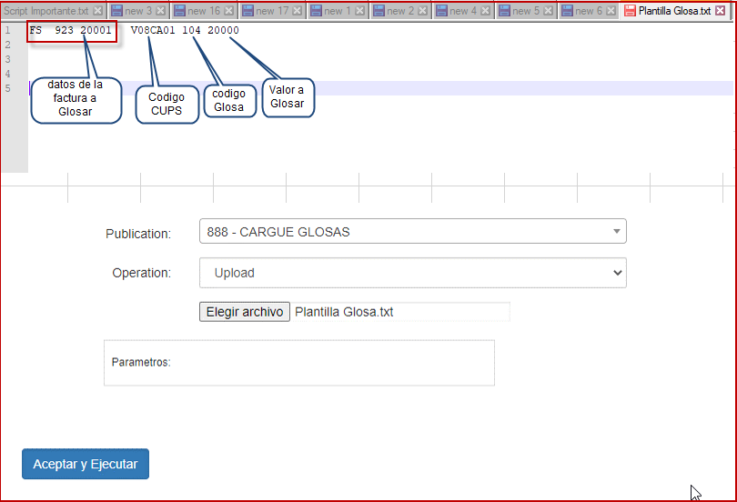
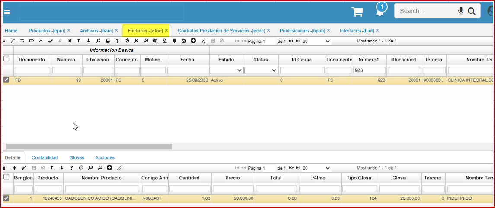

# FACTURAS

Las facturas de salud **[EFAC]** se emiten a través de un proceso de interface [BINT] donde se carga el RIPS (registro individual de prestación de servicios).  
Existe dos escenarios: uno donde el sistema crea una glosa cuando la diferencia es menos a 30.000 se crea un documento **GT** (GLOSA TEMPORAL)  
El segundo escenario cuando es mayor a 30.000 se crea un documento **FD** (NOTA DEBITO SALUD).  

  

**Documento:** desde el BDOC basico de documento se realiza la parametrizacion.  
**Numero:** consecutivo automatico del BCNS.  
**Ubicacion:** parametrizacion creada en basico de ubicaciones.  
**Concepto:** desde el BDOC basico de documento se realiza la parametrizacion.  
**motivo:** parametrizacion del BMOT.  
**Fecha:** se inserta automaticamente al crear el documento o fecha del archivo plano.  
**Estado:** activo, procesado anulado segun corresponda.  
**Status:** desde el BDOC pestaña status se parametriza ejemplo: preradicada, no procede, avalada, avalada glosa, concurrencia, radicada, devuelta, enviada auditoria, entre otras.  
**Documento1:** documento asociado factura.  
**Numero1:** documento asociado factura.  
**Ubicacion1:** documento asociado factura.  
**Tercero:** IPS a quien se factura.  
**Facturas Char:** campo de control interno, alfanumerico.  
**Periodo:** mes del documemento.  
**Año:** año de realizacion de la factura.  

* Se crea y parametriza una interface **BINT** donde a través de un archivo plano que debe tener está estructura; para que  permita cargar masivamente glosas a facturas. Se realizo corrección al procedimiento debido que el cliente 	no tiene el código CUPS, se ajusta el procedimiento para la carga correcta.  

  

Al cargar el archivo se evidencia que carga correctamente.  

  

Al validar en el EFAC se evidencia que crea el documento de Glosa FD.  

