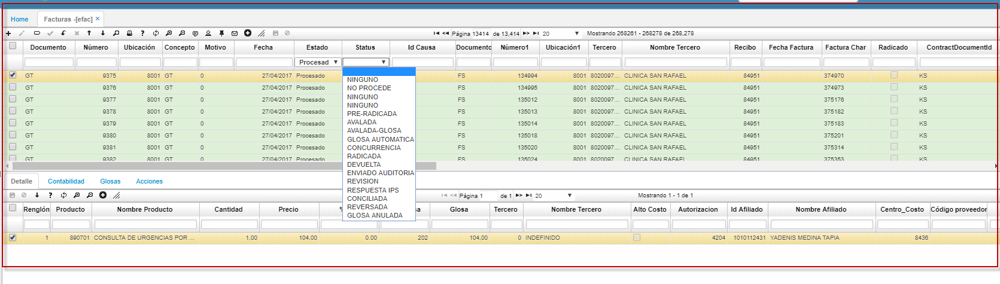

# FACTURAS

Las facturas de salud **[EFAC]** se emiten a través de un proceso de interface [BINT] donde se carga el RIPS (registro individual de prestación de servicios).  
Existe dos escenarios: uno donde el sistema crea una glosa cuando la diferencia es menos a 30.000 se crea un documento **GT** (GLOSA TEMPORAL)  
El segundo escenario cuando es mayor a 30.000 se crea un documento **FD** (NOTA DEBITO SALUD).  

  

**Documento:**
**Numero:**
**Ubicacion:**
**Concepto:**
**motivo:**
**Fecha:**
**Estado:**
**Status:**
**Documento1:**
**Numero1:**
**Ubicacion1:**
**Tercero:**
**Facturas Char:**
**Periodo:**
**Año:**

