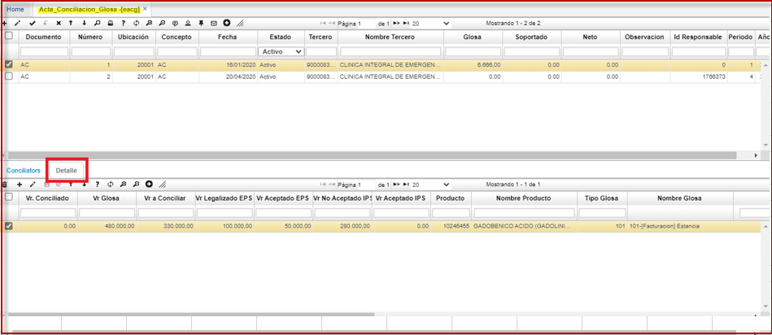
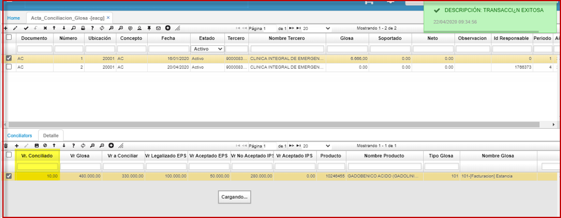

# Acta de conciliación  

En esta opcion **EACG** se genera un documento de conciliación de las glosas que **no** han sido aceptadas o levantadas por el Prestador. Este documento realiza la cancelación de las provisiones generadas por las glosas y genera la cuenta por pagar del valor conciliado a favor de la IPS.  
Se realiza la validación de la funcionalidad sobre el ambiente productivo de Dusakawi.  
Ingresamos al programa **EACG**	 
Se realiza la creación del modelo para la segunda pestaña del detalle  

  
se deja activado el campo:  
valor conciliado   

  

