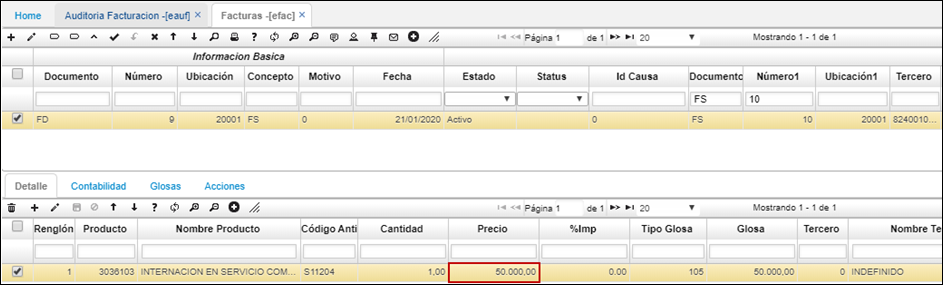

# EAUF - Auditoría POS / Cuentas Médicas y Glosas 

> + [Detalle aplicación EAUF – Auditoría Facturación](http://docs.oasiscom.com/Operacion/is/salud/efactura/movaud/eauf#detalle-aplicación-eauf---auditoría-facturación)
> + [Conciliación de Glosas](http://docs.oasiscom.com/Operacion/is/salud/efactura/movaud/eauf#conciliación-de-glosas)
> + [Respuesta IPS](http://docs.oasiscom.com/Operacion/is/salud/efactura/movaud/eauf#respuesta-ips)
> + [Respuesta EPS](http://docs.oasiscom.com/Operacion/is/salud/efactura/movaud/eauf#respuesta-eps)

Por medio de la aplicación **EAUF – Auditoría Facturación,** se realiza el proceso para auditar las facturas radicadas en el RIPS (Registro Individual de Prestación de Servicio). Esta auditoría es realizada por la EPS.

Para iniciar, los auditores de las facturas deben ingresar a la aplicación EAUF y consultar todas las facturas radicadas dando *Enter* en alguno de los campos de filtro.

  

Desde la aplicación EAUF es posible asignar las auditorías de las facturas a diferentes auditores, para ello, se seleccionan las facturas que se desean asignar a un auditor y se da clic en el botón *“Asignar auditor”* de la barra de herramientas.

  

El sistema arrojará una ventana emergente en donde en el campo **_“Empleado”_** ingresamos el número de identificación del auditor a quien se le asignarán las facturas seleccionadas o lo seleccionamos del zoom y damos clic en el botón *“Submit”.*

El sistema arrojará un mensaje de confirmación indicando que la asignación ha sido exitosa.

En el campo **_“Auditor Asignado” y “Nombre Auditor”_** de la misma aplicación EAUF se visualiza el auditor asignado a las facturas.

**Nota:** Las auditorías a las facturas no obligatoriamente el sistema las restringe a que las realice el empleado asignado, por ello, también se cuenta con el campo **_“Quien Audita”,_** en donde el auditor que realice la revisión a esa factura quedará registrado al momento de dar clic en el botón *“Auditado”* ya que el sistema OasisCom tomará el usuario que se encuentre en sesión en ese momento.

## [Detalle aplicación EAUF – Auditoría Facturación](http://docs.oasiscom.com/Operacion/is/salud/efactura/movaud/eauf#detalle-aplicación-eauf---auditoría-facturación)

En la pestaña *“Detalle”* de la aplicación **EAUF – Auditoría Facturación** se visualiza el servicio que fue prestado al afiliado.

Según el servicio brindado, el auditor puede crear una glosa a la factura dando clic en el botón de la barra de herramientas del detalle *“Creación de Glosa”.*

Al dar clic en el botón “Creación de Glosa” aparecerá una ventana emergente en donde se debe adicionar desde el botón “+” un renglón para registrar la glosa, allí seleccionamos el tipo de glosa, hacemos una observación e indicamos el valor que se va a glosar. Finalmente damos clic en el botón “Guardar” de la barra de herramientas.

El sistema arrojará un mensaje de confirmación indicando que el registro fue exitoso. 

La glosa creada se va a visualizar en la pestaña del detalle *“Glosas”.*

Después de creadas las glosas en la factura, se debe dar clic en el botón *“Auditada”* ubicado en la barra de herramientas del maestro. 

**_Nota:_** En la aplicación **EAUF – Auditoría Facturación,** la factura puede estar en diferentes estatus como: *“Auditada”,* lo que indica que no se le generaron glosas a la factura y sólo se ejecutó el botón *auditar. “Levantamiento”,* lo que indica que efectivamente se le crearon glosas a la factura, entre otros estatus. 

Después de dar clic en el botón *“Auditada”,* el sistema creará un documento **FD** con estado *Activo* en la aplicación **EFAC - Facturas,** en donde se mostrarán las glosas creadas por cada factura. Validadas las glosas, se debe procesar el registro dando clic en el botón. 

En los campos **_“Documento 1” y “Número 1”_** se puede visualizar la factura con la que se está relacionando la glosa, estos campos también nos sirve para consultar la factura auditada anteriormente en EAUF.

## [Conciliación de Glosas](http://docs.oasiscom.com/Operacion/is/salud/efactura/movaud/eauf#conciliación-de-glosas)

Por medio de la aplicación **EEACO – Conciliación Glosa** la IPS ingresa para realizar la conciliación de las glosas que la EPS ha generado a las facturas emitidas por la IPS.

La IPS ingresa a la aplicación *EEACO,* en la cual al consultar solo podrá visualizar las facturas asignadas a dicha IPS como prestador de servicio.

En esta aplicación sólo se mostrarán las glosas que están pendientes por conciliar.

## [Respuesta IPS](http://docs.oasiscom.com/Operacion/is/salud/efactura/movaud/eauf#respuesta-ips)

En la pestaña **_“Respuesta IPS”_** del detalle, se debe ingresar la respuesta que la IPS da sobre las glosas realizadas a los servicios prestados, para ello, se debe seleccionar el renglón de la glosa en el detalle lo cual habilitará la edición de este. 

Allí, en el campo **_“Respuesta”_** la IPS diligenciará cuál es su respuesta a la glosa de la EPS, si es ACEPTADA o NO ACEPTADA, seguidamente, en el campo **_“Soportado”_** se puede ingresar el valor que la IPS le está soportando a la EPS sobre el valor del servicio y en el campo **_“Aceptado”_** el valor que acepta de la glosa.

Ingresados estos datos, se debe dar clic en el botón *“Guardar”* del registro.

## [Respuesta EPS](http://docs.oasiscom.com/Operacion/is/salud/efactura/movaud/eauf#respuesta-eps)

Después de haber ingresado la respuesta la IPS, la EPS debe ingresar a la aplicación **_“EACO – Conciliación Glosas”_** en donde registrará su respuesta a las glosas generadas a las facturas.

En la aplicación *EACO* se debe seleccionar la factura a la cual la EPS va a dar respuesta.

En el detalle se pueden visualizar en cada una de las pestañas las glosas de la factura, la respuesta de la IPS y la respuesta de la EPS.

En la pestaña *“Respuesta EPS”* se debe ingresar en el campo **_“Respuesta Auditoría”_** cuál es la respuesta que da la EPS a la respuesta de la IPS ante la glosa de la factura, seguidamente, en el campo **_“Vr. Legalizado”_** ingresará el valor que como EPS legalizará para pagar a la IPS. En los siguientes campos, se visualizará el valor aceptado por la IPS según su respuesta, valor del servicio en la factura, el servicio brindado, el tipo de glosa y alguna observación de la glosa.

Después de ingresada la respuesta de la EPS con el valor a legalizar, guardamos el registro del detalle y damos clic en el botón **_“Legalizar”_** ubicado en la barra de herramientas del maestro. 

Lo anterior, hará que se genere un documento **FL** en la aplicación **EFAC - Facturas** en estado PROCESADO.

En EFAC para consultar el documento **FL** generado, se puede filtrar por el número físico de la factura en el campo **“Factura Char”.** En el detalle de la aplicación, se visualiza el valor legalizado por la EPS.

**Nota:** En la aplicación **EFAC – Facturas,** al consultar por número de factura física, se podrá visualizar la trazabilidad de la factura FS, la glosa FD y la legalización de la glosa FL.

