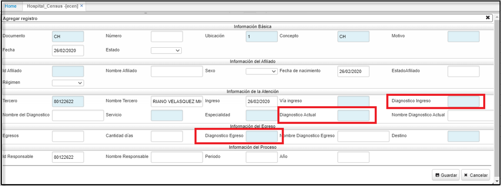
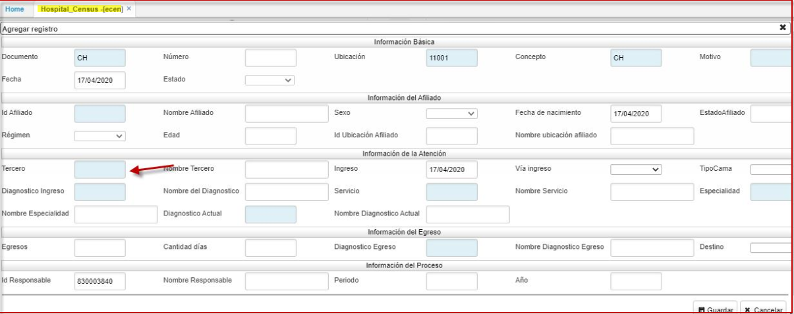
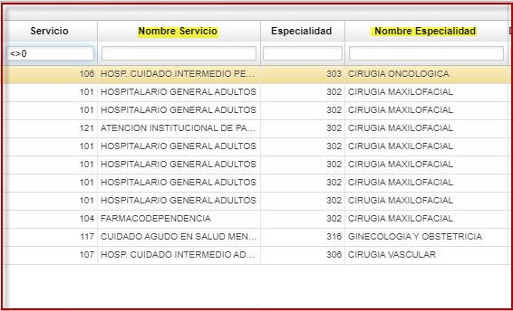

# Censo Hospitalario  

Mediante la siguiente aplicación **ECEN:** la **IPS** informa el ingreso del paciente a la **EPS**, se registra **información del afiliado**, detallando datos como: diagnostico, vía de ingreso, servicio, especialidad; **información del egresado:** cantidad de días, diagnostico en el momento de la salida del paciente; e **información del Proceso**: nombre del responsable entre otros datos.  

Se agrega zoom a los siguientes campos marcados.  
Ajuste sobre campos servicio y diagnostico egreso ya que no se guardaba los datos seleccionados para estos campos.  

  

  

* Se adecua zoom para que solo muestre terceros de salud, debido que anteriormente estaba mostrando terceros en general (afiliado, cliente, proveedor, empleado..)  

  

* Dentro de este mismo zoom de tercero, se agrego el **nombre del servicio** y **nombre de especialidad**, como opciones de búsqueda.    
  

