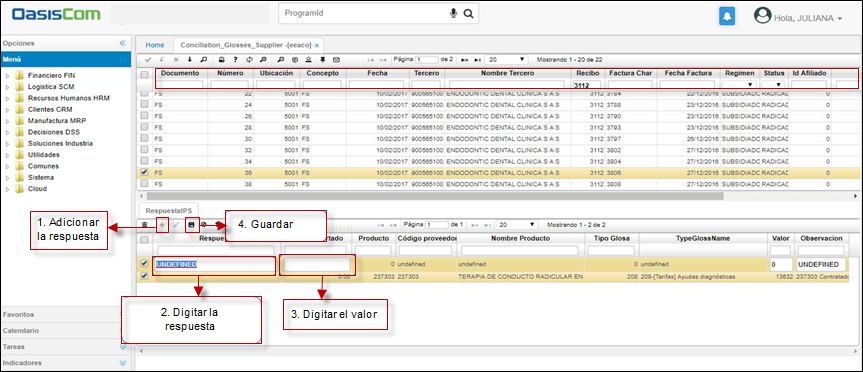

# EEACO - Aplicación de Conciliación de Glosas

La aplicación **EEACO** permite la conciliación entre la *IPS* y la *EPS* referente a las glosas generadas; en la cual se busca llegar a un acuerdo entre ambas partes, permitiendo al prestador emitir un concepto de respuesta a la factura glosada.

Para consultar las glosas generadas debe ingresar a la aplicación **EEACO**, allí debe escoge el campo requerido e ingresar los datos en el *campo de texto.* 

