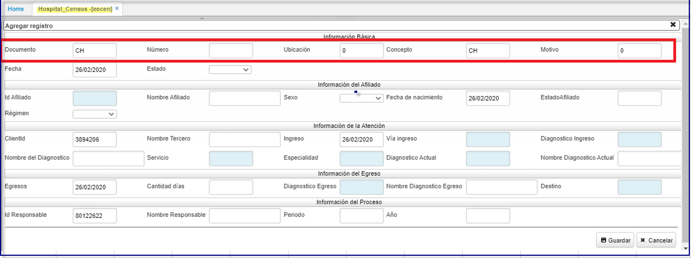
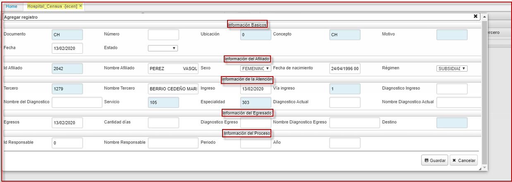

# Censo Hospitalario  EECEN

Se crea programa **Censo hospitalario** **[EECEN]**, enfocado para los prestadores IPS, realiza filtro de organizationid,  por el usuario; se realiza ajuste para que la informacion sea extraida segun la organizacion prestadora.
* La información será filtrada por: documento, numero, ubicación, concepto, motivo y tercero (clientId), según parametrización realizada desde el SCAM [campos].

  

Mediante la siguiente aplicación **ECEN:** la **IPS** informa el ingreso del paciente a la **EPS**, se registra **información del afiliado**, detallando datos como: diagnostico, vía de ingreso, servicio, especialidad; **información del egresado:** cantidad de días, diagnostico en el momento de la salida del paciente; e **información del Proceso**: nombre del responsable entre otros datos.  

  

El campo tercero se le realiza adecuación agregando los campos: **nombre del servicio y nombre de especialidad.** para facilitar la búsqueda en el zoom.  

