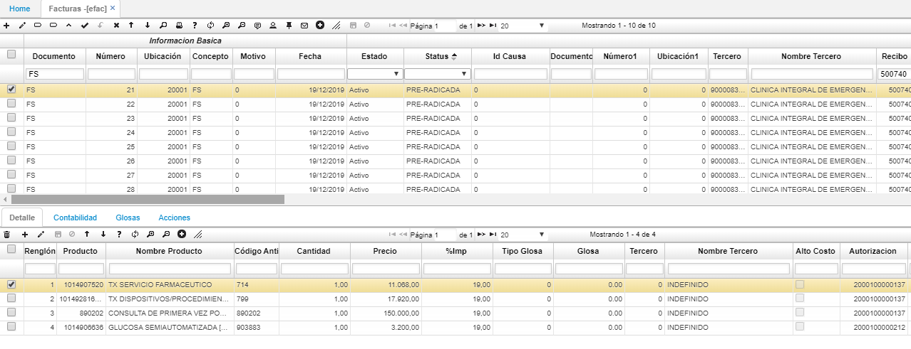

# EFAC - Facturas  

La aplicación **EFAC** permite radicar y procesar las facturas que se generaron, después de haber ejecutado el proceso en la aplicación [**ERIP - RIPS**](http://docs.oasiscom.com/Operacion/is/salud/efactura/profac/erip).  

Ejecutado el proceso de radicación en la aplicación [**ERIP - RIPS**](http://docs.oasiscom.com/Operacion/is/salud/efactura/profac/erip), el sistema creará un documento **FS** en estado “Activo” en la aplicación **EFAC** por cada una de las facturas contenidas en el recibo y, en el detalle, se visualizarán los productos de cada factura. Estas facturas serán generadas con status **“PRE-RADICADA”**.  

**Nota:** cuando se generan los documentos **FS** también se generarán los documentos **GT**, dado que desde la ejecución del proceso de radicación de RIPS en la aplicación [**ERIP - RIPS**](http://docs.oasiscom.com/Operacion/is/salud/efactura/profac/erip), se valida si existen diferencias entre lo facturado y contratado, donde el sistema creará automáticamente las glosas que pueden ser de dos tipos:

* **Caso 1:** El sistema crea una glosa con documento _GT (GLOSA TEMPORAL)_ cuando la diferencia es menos a 30.000.  
* **Caso 2:** Cuando la diferencia es mayor a 30.000 se crea un documento FD (NOTA DEBITO SALUD).  

En la pestaña **“Glosas”** se visualizarán las glosas relacionadas a la factura en caso de existir.  

Seguidamente, la EPS debe verificar cada factura generada en EFAC, el número de factura que se visualiza en el campo _Factura Char_ debe corresponder al número de factura física. De estar correcto, se radica la factura por medio del botón **_Radicar_** de la barra de herramientas.  

Las facturas se pueden radicar una a una o masivamente al seleccionar varias y dar click en el botón **_Radicar_**.  

Posteriormente de haber radicado las facturas, se deben procesar por medio del botón **_Procesar_**. Las facturas deben estar radicadas previamente, si no el sistema no las dejará procesar.  

Las facturas quedarán en estado _Procesado_ y con status **“RADICADA”**.  

Finalmente, procesadas y seleccionadas las facturas, se debe dar clic en el botón _Enviar auditoria_ iniciando así el proceso de **Auditoría de Cuentas Médicas**.  

