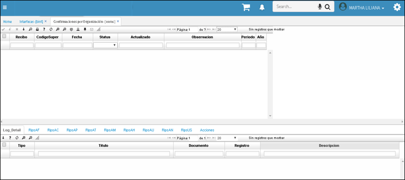

# EEREC - Confirmaciones por Organización  

Por medio de la aplicacion **EEREC** se consultan los **RIPS** cargados previamente, por medio de la aplicacion **BINT**, tal como se explica en el manual [**Cargue de RIPS**](http://docs.oasiscom.com/Operacion/utility/barchi/bint#cargue-de-rips)

Para consultar el estado de **RIPS** cargado, digite el número de este en el campo **Recibo.**

