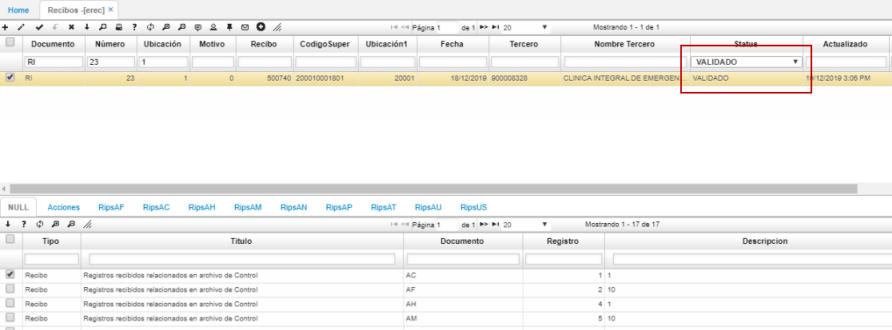

# EREC - Recibos  

## Validación de RIPS  

El cargue de **RIPS** es realizado por el prestador externo por medio de la aplicación **BINT - Interfaces** tal como se explica en el manual de [**Cargue de RIPS**]().  

Cargados los RIPS en el sistema por parte del prestador, la EPS debe ingresar a la aplicación **EREC - Recibos** para consultar y radicar las facturas. Estas facturas tendrán asignado el status _**Cargado**_ cuando sean subidas por el prestador.  

El sistema validará los RIPS cargados con un proceso interno que verifica la malla validadora una vez el prestador cargue el archivo, de estar correcta la información, asignará el status _**Validado**_ a la factura y si encuentra algún error asignará el status _**Rechazado**_.  

_Validado_

_Rechazado_

También se podrá asignar el status _**Devuelto**_ en caso de que la factura sea devuelta al prestador por alguna inconsistencia.  

#### Detalle EREC  

En el detalle de la aplicación **EREC - Recibos** están las pestañas correspondientes a los archivos RIPS _(RipsAF, RipsAC, RipsAH, RipsAM, RipsAN, RipsAP, RipsAT, RipsAU, RipsUS)_ en donde por cada pestaña se visualizarán los recibos correspondientes a cada una.  

Identificados los recibos con estado _**Validado**_ para radicar, la EPS debe ingresar a la aplicación [**ERIP - RIPS**]() y generar la radicación de las facturas. (_Consultar aplicación ERIP_).  

