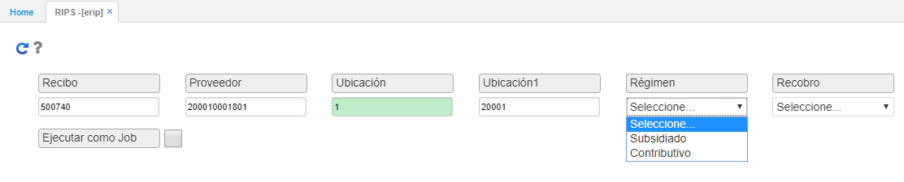
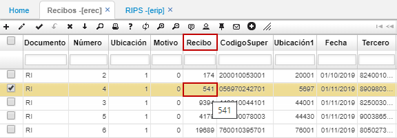
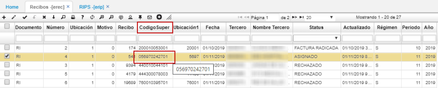
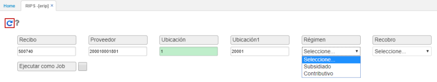

# ERIP - RIPS

La aplicación **ERIP - RIPS** permite generar la radicación de las facturas previamente validadas en la aplicación [**EREC - Recibos**](http://docs.oasiscom.com/Operacion/is/salud/efactura/profac/erec) correspondientes a los recibos cargados por los prestadores externos.  

Identificados en la aplicación EREC los recibos a radicar con estado _**Validado**_ , la EPS debe ingresar a la aplicación **ERIP - RIPS** y generar la radicación de las facturas diligenciando los siguientes campos:  

**Recibo:** número del recibo que se va a radicar, este número es el que aparece en la aplicación [**EREC - Recibos**](http://docs.oasiscom.com/Operacion/is/salud/efactura/profac/erec).  

**Proveedor:** en el campo "proveedor" se debe ingresar el Código Super que aparece en EREC.  

**Ubicación:** ingresar la ubicación en la cual se cargó el RIPS.  Esta ubicación es la que se visualiza en EREC.  

**Ubicación1:** corresponde a la ubicación en la cual se van a generar las facturas contenidas en el recibo, es decir, la ubicación en la cual van a quedar causadas las facturas.                                                                                 

**Régimen:** seleccionar el régimen al que corresponde el recibo, Subsidiado o Contributivo.  

Ingresados los datos, damos click en el botón _Generar_.  

Seguidamente, una vez generada la radicación de las facturas en la aplicación **ERIP - Recibos**, el sistema creará un documento _**FS**_ en estado **“Activo”** en la aplicación [**EFAC - Facturas**]() por cada una de las facturas contenidas en el recibo. _(Consultar aplicación EFAC para continuar con el proceso)._  

