# EENC - Encuestas

La aplicación EENC permite realizar las Encuestas de Satisfacción al Cliente. Las encuestas de satisfacción se realizan por afiliado. Para crear una nueva encuesta damos click en el botón  _Agregar Nueva Fila_ de la barra de herramientas ubicada en el maestrro de la aplicación.  

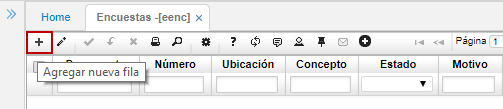

Al momento de agregar una nueva fila el sistema arrojará un formulario en donde debemos agregar los datos correspondientes a la encuesta.  

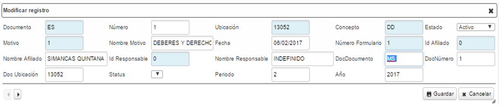

**Documento:** ingresar las siglas del documento con el cual se generará la encuesta o seleccionarlo del zoom. Estos documentos son parametrizados previamente en la aplicación [**BDOC - Documentos**](http://docs.oasiscom.com/Operacion/common/bsistema/bdoc).  

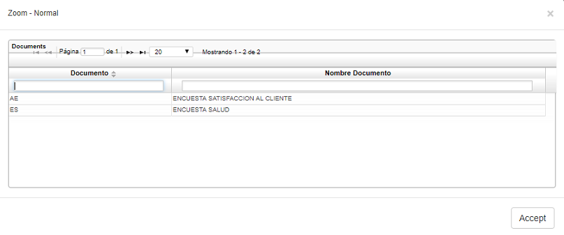

**Ubicación:** ingresar el código correspondiente a la ubicación geográfica desde donde se está generando la encuesta o seleccionarla del zoom. Las ubicaciones se encuentran parametrizadas en la aplicación [**BUBG - Ubicaciones Geográficas**](http://docs.oasiscom.com/Operacion/common/borgan/bubg).  

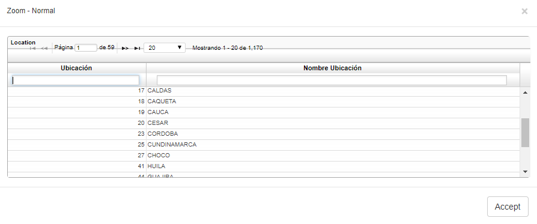

**Concepto:** ingresar las siglas del concepto por el cual se genera la encuesta o seleccionarlo del zoom. Los conceptos son parametrizados en la aplicación [**BCON - Conceptos**](http://docs.oasiscom.com/Operacion/common/bsistema/bcon).  

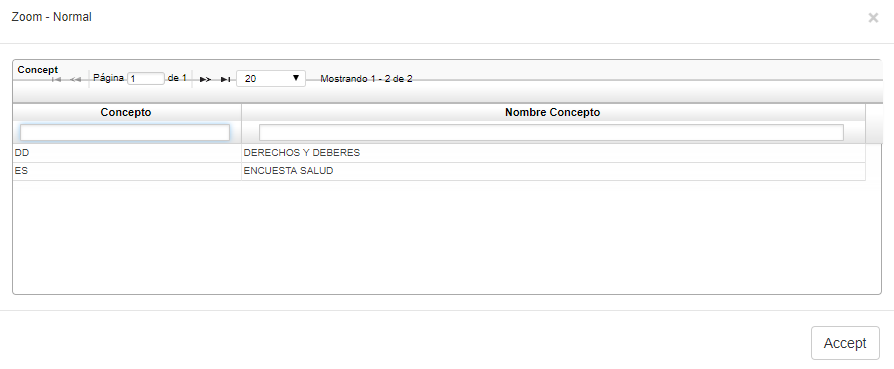

**Estado:** el estado es asignado automáticamente por el sistema, se generará en estado _Activo_.
**Motivo:** indicar el motivo de la encuesta o dar doble click y seleccionarlo del zoom. Los motivos son parametrizados en la aplicación [**BMOT - Motivos**](http://docs.oasiscom.com/Operacion/common/bsistema/bmot).  

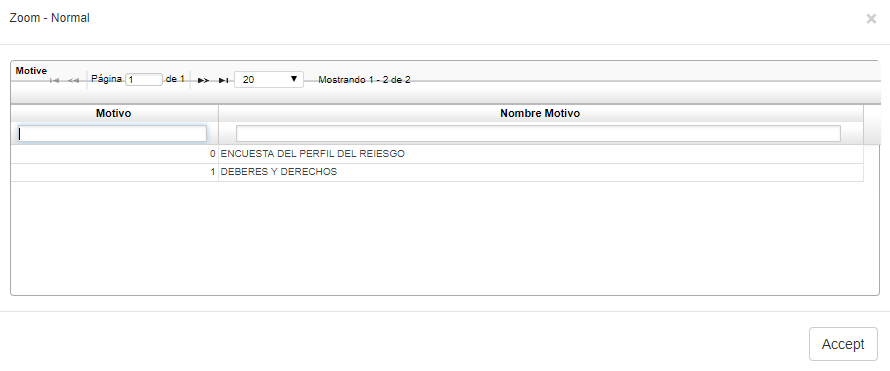

**Nombre Motivo:** el nombre del motivo lo arrojará el sistema automáticamente cuando sea guardado el registro.  
**Fecha:** seleccionar la fecha en la cual se está generando la encuesta.  
**Número Formulario:** En este campo es necesario ingresar al zoom y seleccionar de allí el afiliado que realizará la encuesta de satisfacción. Al seleccionar el afiliado, los demás campos se diligenciarán automáticamente con los datos del mismo.  

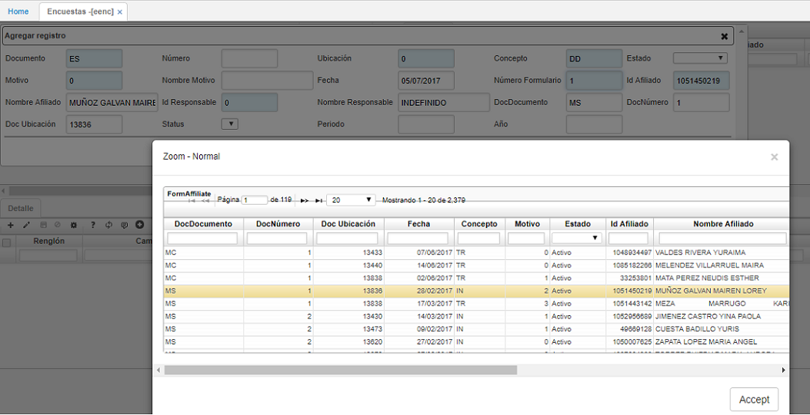

**Periodo:** ingresar el número del mes en el cual se genera la encuesta.  
**Año:** ingresar el año en el cual se genera la encuesta.  

Ingresados los datos del formulario damos click en el botón  y nos dirigimos al detalle de la aplicación.  

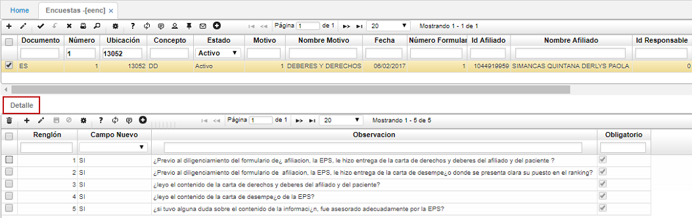

En el **Detalle**, se procede a diligenciar la Encuesta de Satisfacción al Cliente, la cual contiene cinco (5) preguntas por norma (Res. 4343 de 2012 – CCE 000016 de 2013).  

Para responder cada pregunta de la encuesta, editamos cada renglón ya sea dando click sobre el mismo o mediante el botón  _Editar_ y seleccionamos en el campo _Campo Nuevo_ la opción que corresponda según respuesta del afiliado (SI o NO) y damos click en el botón  _Guardar_ de la barra de herramientas del detalle con el fin de confirmar la respuesta de la pregunta editada.  

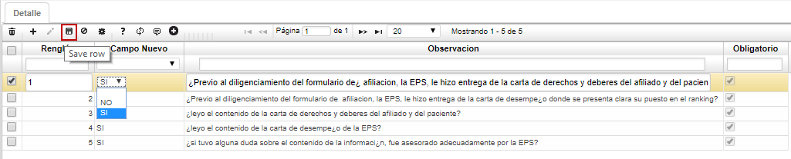

Realizado el anterior proceso con cada una de las preguntas, confirmamos la encuesta dando click en el botón  _Procesar_ de la barra de herramientas del maestro cambiando la encuesta a estado _PROCESADO_. El sistema arrojará un mensaje de control indicando que la operación fue exitosa.  

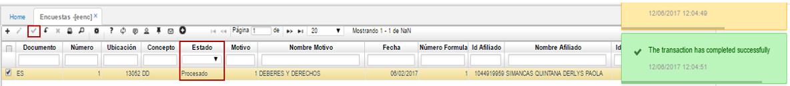

Dando click en el botón  ubicado en la barra de herramientas se obtiene la vista preliminar de la encuesta realizada anteriormente. El sistema permite descargar el documento en formato de Excel, PDF o Word.  

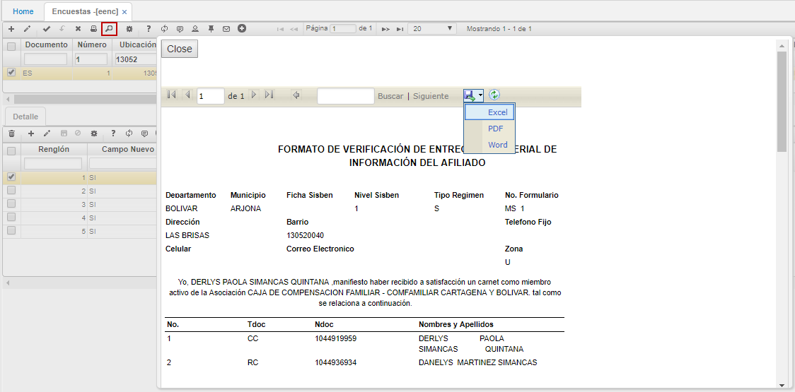

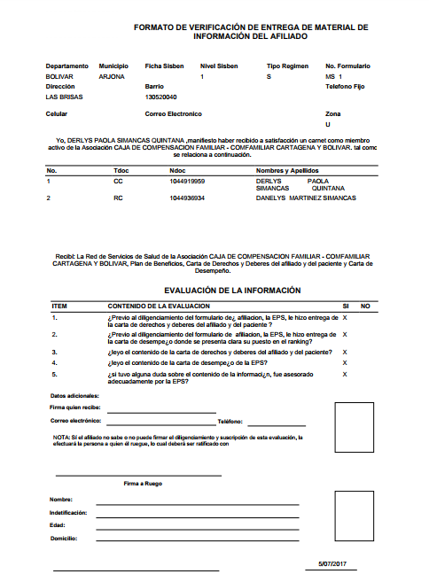
