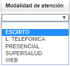
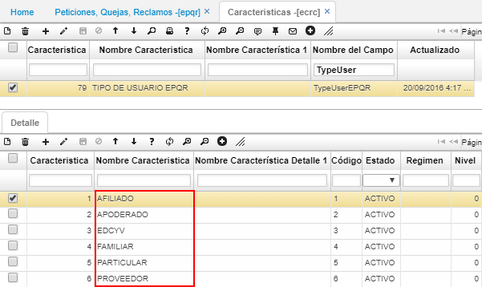
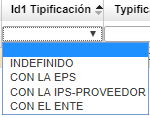
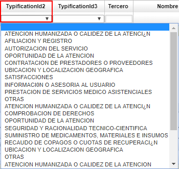
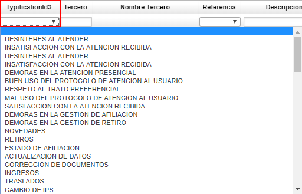
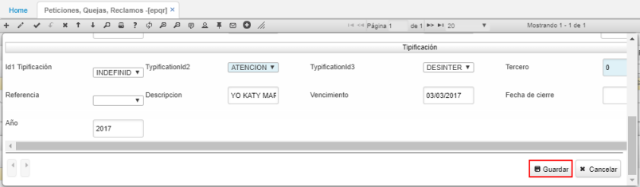
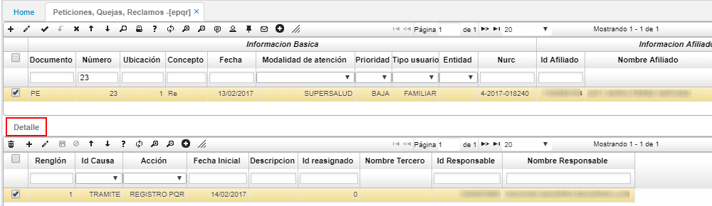
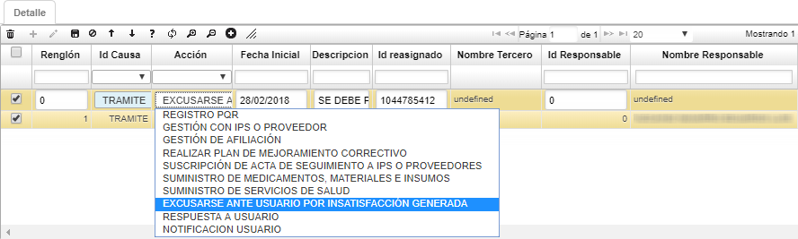

# EPQR - Atencion al Uasuario  
Creación del programa **EATE** (Atencion usuario) que servirá para la captura de solicitudes de información por los clientes de una entidad - atención al usuario realizada por el empleado de la entidad.  
Posee la misms finalidad de las petixciones quejas y reclamos, donde pueden existir escenarios donde un tercero externo que no es afilido, realiza consultas; entre otras diversidad de preguntas que son trasmitidas desde servicio al cliente.   
Su estructura es similar a las peticiones quejas y reclamos.  
Donde en [EPQR] permite registrar las peticiones, quejas, reclamos, felicitaciones que puedan reportar los afiliados y a su vez registrar las actividades que se deberán hacer para solventarlas. Esta aplicación es gestionada por el gestor de PRQS de la EPS.  

Ingresamos a la aplicación, creamos un nuevo registro y diligenciamos el formulario.  

_Información básica_

**Documento:** ingresar el documento parametrizado en la aplicación [**BDOC - Documentos**](http://docs.oasiscom.com/Operacion/common/bsistema/bdoc).  
**Número:** el sistema asignará automáticamente el número de consecutivo.  
**Ubicación:** indicar la ubicación en donde se registra el documento.  
**Concepto:** seleccionar el concepto por el cual se crea el documento, si es una petición, queja, reclamo, felicitación, otra. Estos conceptos pueden ser parametrizados en el detalle de la aplicación [**BDOC**](http://docs.oasiscom.com/Operacion/common/bsistema/bdoc) al consultar por el documento PE.   

**Fecha:** ingresar la fecha en la cual se registra el documento.  
**Motivo:** seleccionar la motivos, parametrizados en BMOT, por la cual se reportó el caso.  
**Estado:** al registrar el caso, el documento quedará en estado activo, cambiará de estado una vez se procese el documento.  
**Status:** seleccionar el status del caso. (Pendiente, gestión, escalada, anulada, solución, notificada, cierre).  

_Información afiliado_

**Id Afiliado:** ingresar el número de identificación del afiliado.  
**Régimen:** seleccionar el régimen si es subsidiado o contributivo.  
**Sexo:**
**fecha de nacimiento:**
**Direccion:**
**Ubicacion Geografica:**

**Prioridad:** seleccionar la prioridad del caso. _Baja, Alta o Crítica_.  
**Tipo usuario:** seleccionar el tipo de usuario que reporta el caso. Las opciones pueden ser parametrizadas en la aplicación [**ECRC - Características**](http://docs.oasiscom.com/Operacion/is/salud/ebasica/ecrc).  

**Nurc:** ingresar el número de radicado del caso reportado.  

_Información Adicional_

Estos datos son de vital importancia, dado que será la base para que el gestor de PQRS se pueda comunicar con la persona reclamante.  

**Tipo documento reclamante:** seleccionar el tipo de documento de la persona que presenta el caso, esta puede ser diferente al afiliado ingresado anteriormente.  
**Id documento reclamante:** ingresar el número de identificación de la persona que presenta el caso.  
**Nombre del reclamante:** ingresar el nombre completo de la persona que presenta el caso.  
**Mail del reclamante:** ingresar el correo electrónico de la persona que presenta el caso.  
**Teléfono del reclamante:** ingresar el número telefónico de la persona que presenta el caso.  
**Dirección del reclamante:** ingresar la dirección de residencia de la persona que presenta el caso.  
**Celular reclamante:** ingresar el número celular de la persona que presenta el caso.  

_Tipificación_

**Tipificación 1:** seleccionar el tipo de entidad con la cual se presentó el caso.  

**Tipificación 2:** seleccionar la categoría o departamento en la cual se presentó el caso.  

**Tipificación 3:** seleccionar la causa que llevó al reporte del caso.  

**Descripción:** Hacer la descripción del caso que se reporta.  
**Vencimiento:** ingresar la fecha de vencimiento del caso reportado.  

Ingresada la información, guardamos el registro y diligenciamos el detalle.  

Al guardar el documento en el maestro, el sistema traerá automáticamente el primer renglón del detalle que será el _REGISTRO_. En el detalle se registrará la gestión realizada al caso reportado.  

Al ingresar un nuevo renglón, se deberá seleccionar si el caso se encuentra en trámite o en cierre, la acción que se deberá realizar para solventar el caso, la fecha en la cual se deberá realizar, hacer una descripción de la actividad, ingresar el número de identificación del funcionario al cual se asigna la actividad y el número de identificación del funcionario que registra la actividad.  

Finalmente, guardamos el registro. Cuando el caso reportado se haya solventado, se debe procesar desde el maestro el documento con el fin de cerrarlo.  