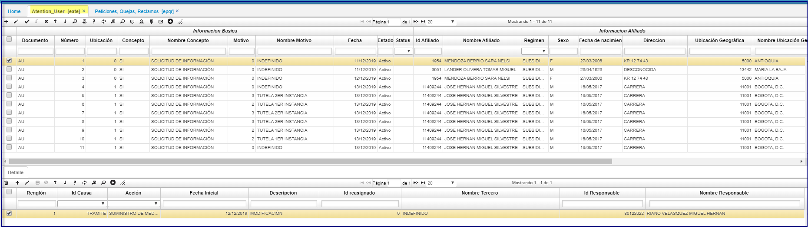
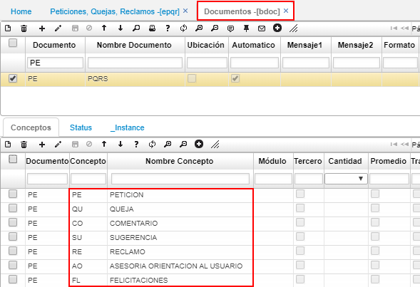

# EATE - Atencion al Uasuario  
Creación del programa **EATE** (Atencion usuario) que servirá para la captura de solicitudes de información por los clientes de una entidad - atención al usuario realizada por el empleado de la entidad.  
Posee la misms finalidad de las petixciones quejas y reclamos, donde pueden existir escenarios donde un tercero externo que no es afilido, realiza consultas; entre otras diversidad de preguntas que son trasmitidas desde servicio al cliente.   
Su estructura es similar a las peticiones quejas y reclamos.  
Donde en [EPQR] permite registrar las peticiones, quejas, reclamos, felicitaciones que puedan reportar los afiliados y a su vez registrar las actividades que se deberán hacer para solventarlas. Esta aplicación es gestionada por el gestor de PRQS de la EPS.  

Ingresamos a la aplicación, creamos un nuevo registro y diligenciamos el formulario.  

_Información básica_

**Documento:** ingresar el documento parametrizado en la aplicación [**BDOC - Documentos**](http://docs.oasiscom.com/Operacion/common/bsistema/bdoc).  
**Número:** el sistema asignará automáticamente el número de consecutivo.  
**Ubicación:** indicar la ubicación en donde se registra el documento.  
**Concepto:** seleccionar el concepto por el cual se crea el documento. Estos conceptos pueden ser parametrizados en el detalle de la aplicación [**BDOC**](http://docs.oasiscom.com/Operacion/common/bsistema/bdoc) al consultar por el documento PE.   

**Fecha:** ingresar la fecha en la cual se registra el documento.  
**Motivo:** seleccionar la motivos, parametrizados en BMOT, por la cual se reportó el caso.  
**Estado:** al registrar el caso, el documento quedará en estado activo, cambiará de estado una vez se procese el documento.  
**Status:** seleccionar el status del caso. (Pendiente, gestión, escalada, anulada, solución, notificada, cierre).  

_Información afiliado_

**Id Afiliado:** ingresar el número de identificación del afiliado.  
**Régimen:** seleccionar el régimen si es subsidiado o contributivo.  
**Sexo:**
**fecha de nacimiento:**
**Direccion:**
**Ubicacion Geografica:**

_Información Adicional_

Estos datos son de vital importancia, dado que será la base para que el gestor de EATE se pueda comunicar con la persona responsable.  

**Id responsable:** ingresar el número de identificación de la persona que presenta el caso.  
**Nombre del responsable:** ingresar el nombre completo de la persona que presenta el caso.  

