---

layout: default
title: Peticiones Quejas y Reclamos
permalink: /Operacion/is/salud/esiau/movsiau/epqr
editable: si

---

# EPQR - Peticiones Quejas y Reclamos

Esta ventana permite registrar peticiones, quejas, reclamos, felicitaciones que puedan reportar los afiliados. A su vez registrar actividades que se deberán hacer para solventarlas.

La aplicación que se usa es **EPQR** - Peticiones, quejas, reclamos.

- [Peticiones, Quejas y Reclamos](http://docs.oasiscom.com/Operacion/is/salud/esiau/movsiau/epqr#peticiones-quejas-y-reclamos)

- [Atención al usuario](http://docs.oasiscom.com/Operacion/is/salud/esiau/movsiau/epqr#atención-al-usuario)

## [Peticiones, Quejas y Reclamos](http://docs.oasiscom.com/Operacion/is/salud/esiau/movsiau/epqr#peticiones-quejas-y-reclamos)

La aplicación **EPQR – Peticiones, Quejas, Reclamos,** permite registrar las peticiones, quejas, reclamos, felicitaciones que puedan reportar los afiliados y a su vez registrar las actividades que se deberán hacer para solventarlas. Esta aplicación es gestionada por el gestor de PQRS de la EPS.

Ingresamos a la aplicación, creamos un nuevo registro y diligenciamos el formulario.

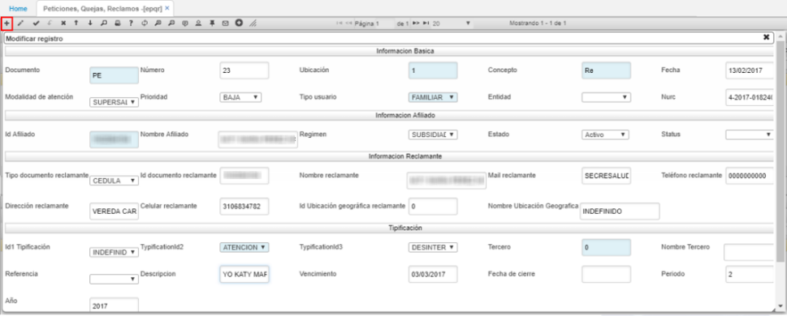

En la sección de *Información Básica* se encuentran los siguientes campos:

**Documento:** ingresar el documento PE correspondiente a PQRS. El documento se parametriza en la aplicación **BDOC - Documentos.**

**Número:** el sistema asignará automáticamente el número de consecutivo.

**Ubicación:** indicar la ubicación en donde se registra el documento.

**Concepto:** seleccionar el concepto por el cual se crea el documento, si es una petición, queja, reclamo, felicitación, otra. Estos conceptos pueden ser parametrizados en el detalle de la aplicación **BDOC** al consultar por el documento PE.

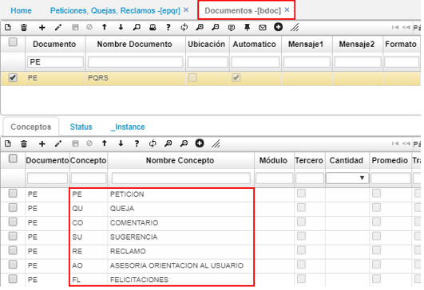

**Fecha:** ingresar la fecha en la cual se registra el documento.

**Modalidad de atención:** seleccionar la modalidad por la cual se reportó el caso.

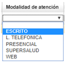

Las modalidades de atención pueden ser parametrizadas en la aplicación **ECRC - Características.**

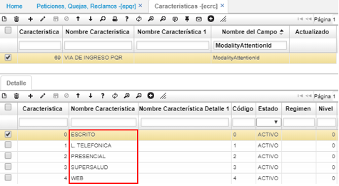

**Prioridad:** seleccionar la prioridad del caso. Baja, Alta o Crítica.

**Tipo usuario:** seleccionar el tipo de usuario que reporta el caso. Las opciones pueden ser parametrizadas en la aplicación **ECRC - Características.**

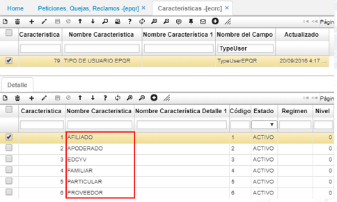

**Nurc:** ingresar el número de radicado del caso reportado.

En la sección de *Información afiliado* se encuentran los siguientes campos:

**Id Afiliado:** ingresar el número de identificación del afiliado.

**Régimen:** seleccionar el régimen si es subsidiado o contributivo.

**Estado:** al registrar el caso, el documento quedará en estado activo, cambiará de estado una vez se procese el documento.

**Status:** seleccionar el status del caso. (Pendiente, gestión, escalada, anulada, solución, notificada, cierre).

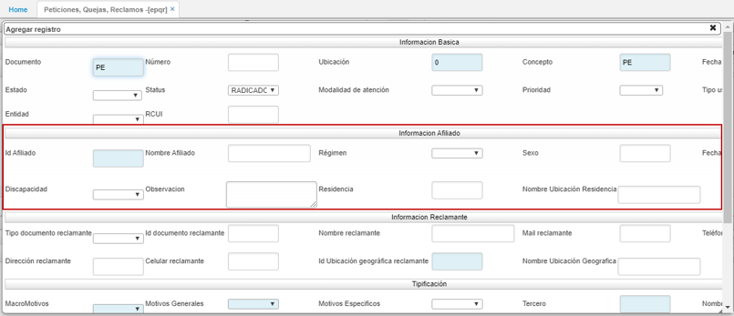

En la sección de *Información reclamante* se encuentran los siguientes campos:

Estos datos son de vital importancia, dado que será la base para que el gestor de PQRS se pueda comunicar con la persona reclamante.

**Tipo documento reclamante:** seleccionar el tipo de documento de la persona que presenta el caso, esta puede ser diferente al afiliado ingresado anteriormente.

**Id documento reclamante:** ingresar el número de identificación de la persona que presenta el caso.

**Nombre del reclamante:** ingresar el nombre completo de la persona que presenta el caso.

**Mail del reclamante:** ingresar el correo electrónico de la persona que presenta el caso.

**Teléfono del reclamante:** ingresar el número telefónico de la persona que presenta el caso.

**Dirección del reclamante:** ingresar la dirección de residencia de la persona que presenta el caso.

**Celular reclamante:** ingresar el número celular de la persona que presenta el caso.

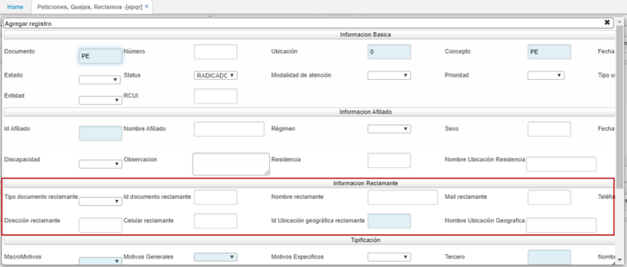

En la sección de Tipificación se encuentran los siguientes campos:

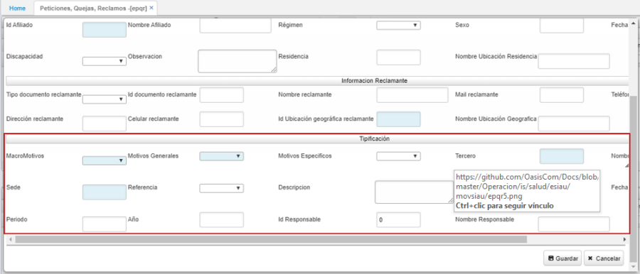

**Tipificación 1:** seleccionar el tipo de entidad con la cual se presentó el caso.

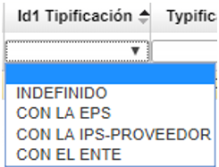

**Tipificación 2:** seleccionar la categoría o departamento en la cual se presentó el caso.

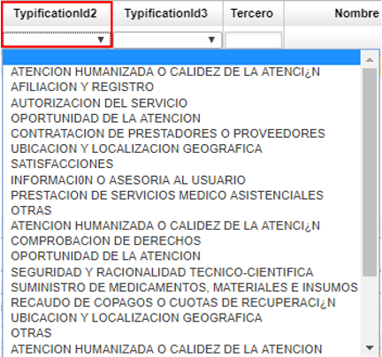

**Tipificación 3:** seleccionar la causa que llevó al reporte del caso.

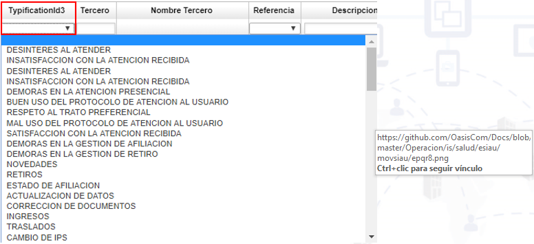

**Descripción:** Hacer la descripción del caso que se reporta.

**Vencimiento:** ingresar la fecha de vencimiento del caso reportado.

Ingresada la información, guardamos el registro y diligenciamos el detalle.

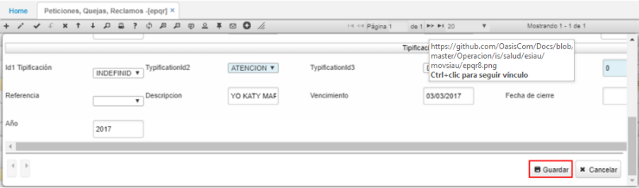

Al guardar el documento en el maestro, el sistema traerá automáticamente el primer renglón del detalle que será el *REGISTRO.* En el detalle se registrará la gestión realizada al caso reportado.

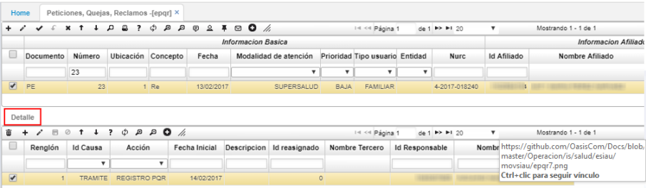

Al ingresar un nuevo renglón, se deberá seleccionar si el caso se encuentra en trámite o en cierre, la acción que se deberá realizar para solventar el caso, la fecha en la cual se deberá realizar, hacer una descripción de la actividad, ingresar el número de identificación del funcionario al cual se asigna la actividad y el número de identificación del funcionario que registra la actividad.

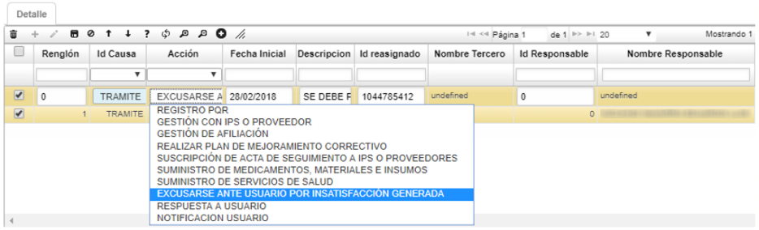

Finalmente, guardamos el registro. Cuando el caso reportado se haya solventado, se debe procesar desde el maestro el documento con el fin de cerrarlo.

## [Atención al usuario](http://docs.oasiscom.com/Operacion/is/salud/esiau/movsiau/epqr#atención-al-usuario)

La aplicación **EATE – Atención Usuario,** permite registrar la atención que se le brinda a los usuarios y los motivos de dicha atención, esto con el fin de tener un histórico.

Se ingresa a la aplicación EATE y se crea un nuevo registro.

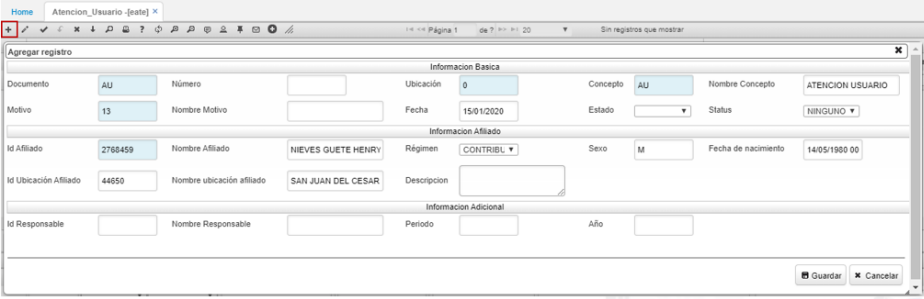

Se creará un documento *US con igual concepto US – Atención Usuario,* en el campo *Motivo* se debe dar doble clic y seleccionar el motivo por el cual el usuario solicitó la atención.

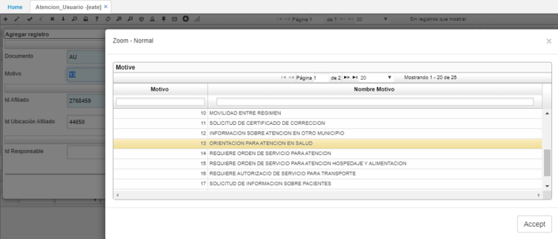

Seguidamente, en el campo *Id Afiliado,* seleccionamos del zoom el usuario o afiliado que solicitó la atención o por el cual se solicitó la atención.

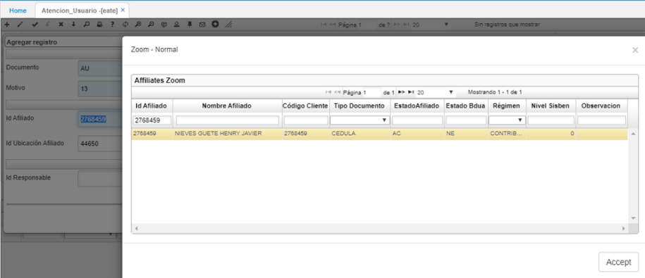

Al dar clic en *Aceptar,* el sistema traerá los demás datos del afiliado.

En el campo *Descripción* se debe detallar cuál fue la atención que solicitó el usuario.

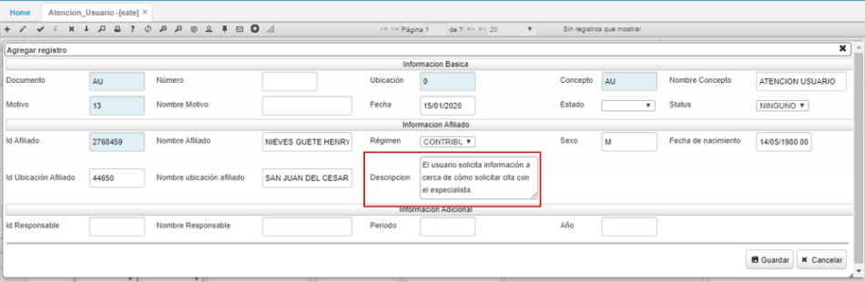

Finalmente, se da clic en el botón *Guardar* y el sistema arrojará un mensaje de confirmación, lo cual indica que se registró exitosamente la atención al usuario.

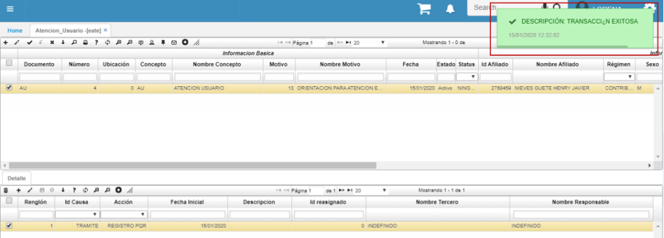

