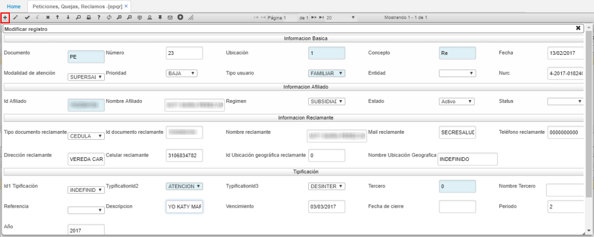

# EPQR - Peticiones Quejas y Reclamos

La aplicación **EPQR** permite registrar las peticiones, quejas, reclamos, felicitaciones que puedan reportar los afiliados y a su vez registrar las actividades que se deberán hacer para solventarlas. Esta aplicación es gestionada por el gestor de PRQS de la EPS.  

Ingresamos a la aplicación, creamos un nuevo registro y diigenciamos el formulario.  

_Información básica_

**Documento:** ingresar el documento PE correspondiente a PQRS. El documento se parametriza en la aplicación [**BDOC - Documentos**](http://docs.oasiscom.com/Operacion/common/bsistema/bdoc).  
**Número:** el sistema asignará automáticamente el número de consecutivo.  
**Ubicación:** indicar la ubicación en donde se registra el documento.  
**Concepto:** seleccionar el concepto por el cual se crea el documento, si es una petición, queja, reclamo, felicitación, otra. Estos conceptos pueden ser parametrizados en el detalle de la aplicación [**BDOC**](http://docs.oasiscom.com/Operacion/common/bsistema/bdoc) al consultar por el documento PE.   

**Fecha:** ingresar la fecha en la cual se registra el documento.  
**Modalidad de atención:** seleccionar la modalidad por la cual se reportó el caso.  
**Prioridad:**
**Tipo usuario:**
**Entidad:**
**Nurc:**
**Id Afiliado:**
**Régimen:**
**Estado:**
**Status:**
****
****
****
****
****
****
****
****
****
****
****
