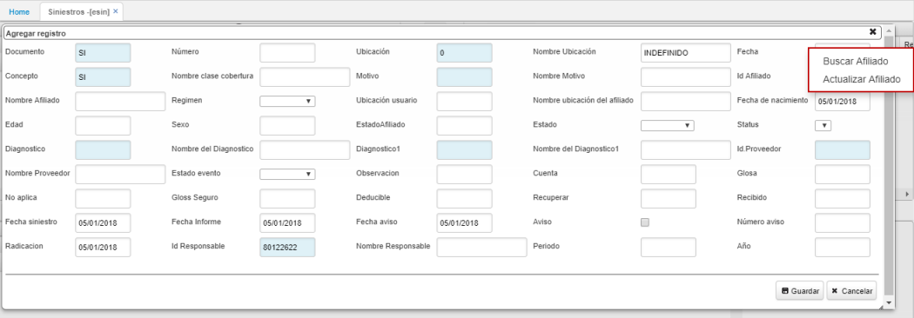
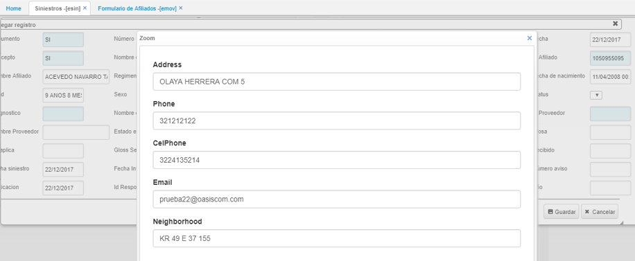
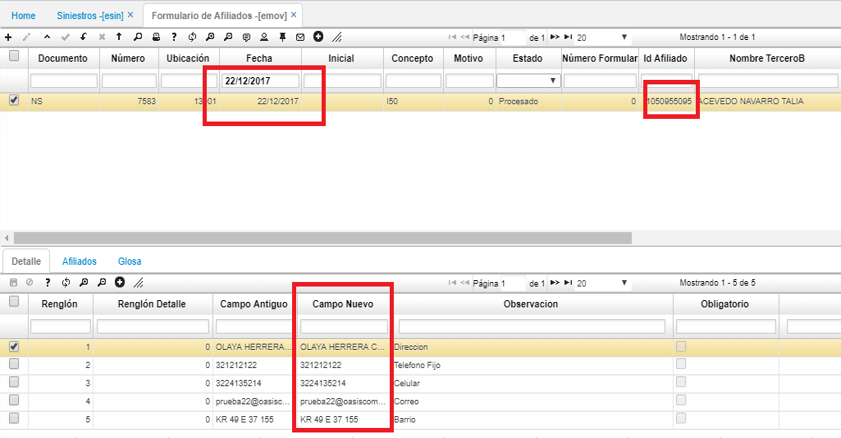
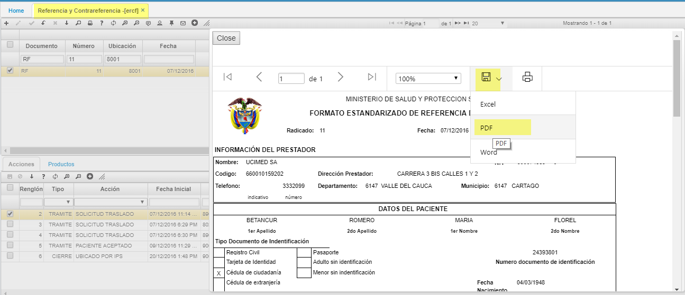
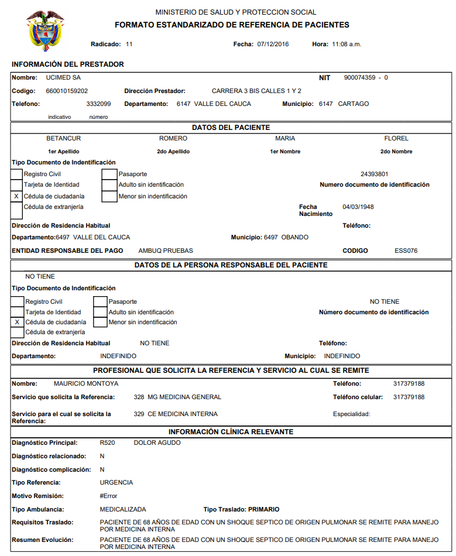
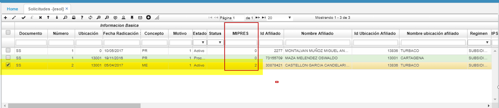

# SALUD

### [Actualización de datos](http://docs.oasiscom.com/Operacion/is/salud/#actualización-de-datos)

Para las opciones **_ESIN - Siniestros, ESOA - Autorizaciones de Aplicación, ESOL - Solicitudes, EAUT - Autorizaciones, ERCF - Referencia y Contrareferencia_** existe un módulo que permite la actualización de los datos del afiliado con previa parametrización en la opción [**BMOT - Motivos**](http://docs.oasiscom.com/Operacion/common/bsistema/bmot), las cuales deben tener el motivo _NSI50_.  

En este caso al dar click derecho sobre el campo _Afiliado_, el cual debe tener un valor, se despliega un menú contextual que define un nuevo elemento en este caso _Actualizar Afiliado_ ,al dar click sobre este elemento se despliega la siguiente figura.  

A continuación, se despliega un formulario que contiene la parametrización del BMOT - Motivos. En este caso el modelo indica que requiere el documento _NS I50_.  

Al guardar los datos y validar el resultado de la operación, se evidencia que se ha creado un nuevo movimiento en la aplicación EMOV que contiene la información que se ha diligenciado en el formulario.  

En la aplicación **ERCF, EERCF**  Referencia y Contrareferencia del paciente podrá exportar, valida campos como:
* peso,  
*  talla,  
*  f. cardiaca,  
*  f. respiratoria,  
*  presion arterial,  
*  temperatura,  
*  saturacion 02,  
*  resumen de examen diagnostico,  
*  complicaciones,  
*  tratamientos aplicados.  
*  Documento Afiliado' y 'Especialidad': Campos adicionados con el objetivo de conocer el documento del afiliado y la especialidad sobre la cual, se crea documento.  
 
 
 
 Al exportar a PDF se visulizara:
 
  
  **ESOL - Solicitudes.  **

* En el formulario de solicitudes  **ESOL** se incluye el campo.  
MIPRES: código que permite a los profesionales de salud reportar la prescripción de tecnologías en salud no financiadas, con recursos de la UPC o servicios complementarios. como se ilustra.

