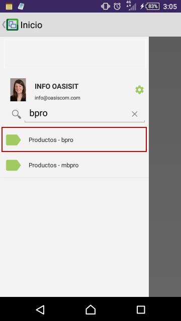
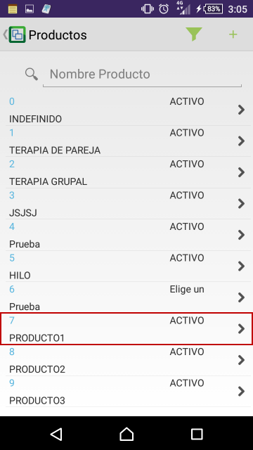
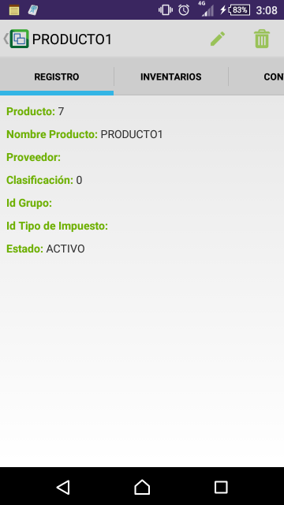
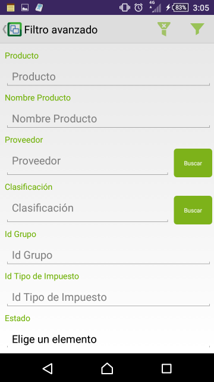
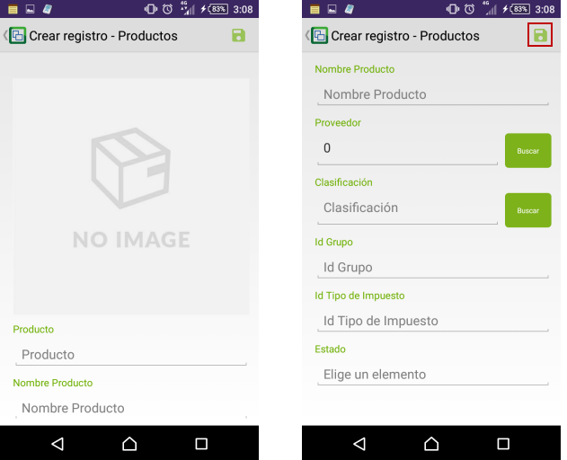

# BPRO - Productos

En esta aplicación se deben parametrizar todos los productos o servicios que ofrece la organización con sus respectivas características.  

Buscamos la aplicación **BPRO** en la aplicacipon móvil de OasisCom y accedemos.  

Al ingresar podremos ver todos los productos registrados en el sistema. Al seleccionar alguno veremos información relacionada al producto.  

La aplicación **BPRO** permite realizar un filtro avanzado mediante el símbolo  con el fin de facilitar la búsqueda de productos.  

Allí ingresaremos los datos por los cuales deseamos filtrar y damos click en el botón 

Para crear un producto, damos click en el botón , diligenciamos los campos y cargamos la imagen del producto.  

Finalmente, damos click en el botón  para guardar la información.  
