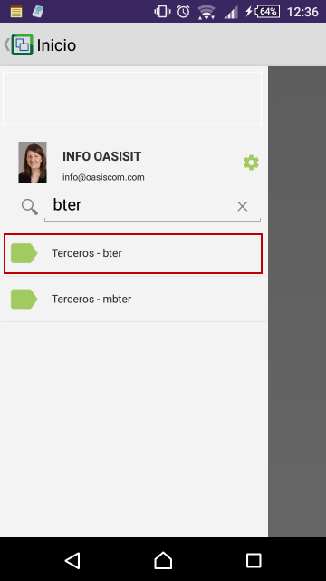
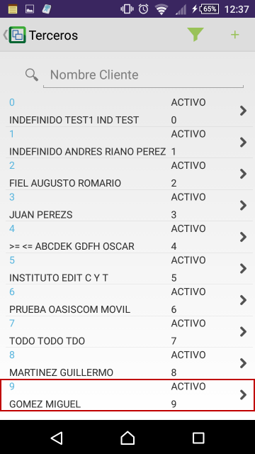
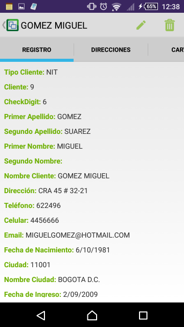
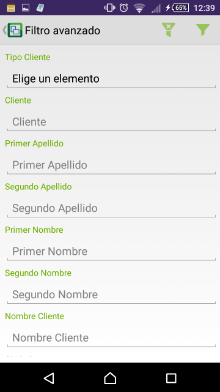
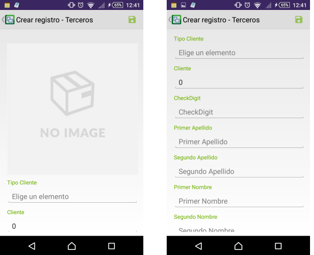
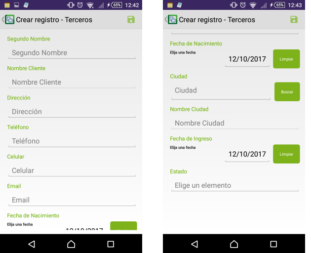

# BTER - Terceros

En esta aplicación parametrizamos o registramos todos los terceros que podemos tener. Para el sistema Oasis la palabra terceros se hace referencia a: empleados, clientes, proveedores, afiliados, vendedores, asociados, entre otros. Es decir, todas las personas que interactúan o se relacionan con nuestro negocio.  

Buscamos la aplicación **BTER** en la aplicacipon móvil de OasisCom y accedemos.  

Al ingresar podremos ver todos los terceros registrados en el sistema. Al seleccionar alguno veremos sus datos personales.  

La aplicación **BTER** permite realizar un filtro avanzado mediante el símbolo  con el fin de facilitar la búsqueda de terceros.  

Allí ingresaremos los datos por los cuales deseamos filtrar y damos click en el botón 

Para crear un tercero, damos click en el botón , diligenciamos los campos y opcionalmente cargamos la imagen del tercero.  

Finalmente, damos click en el botón  para guardar los datos.  
