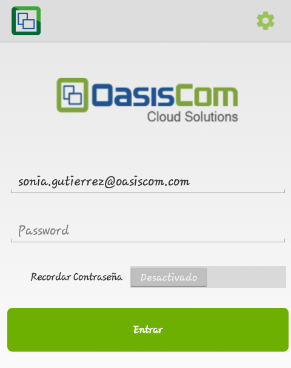
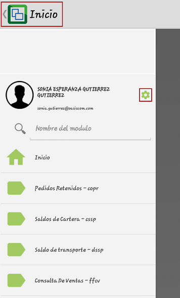
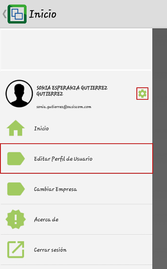
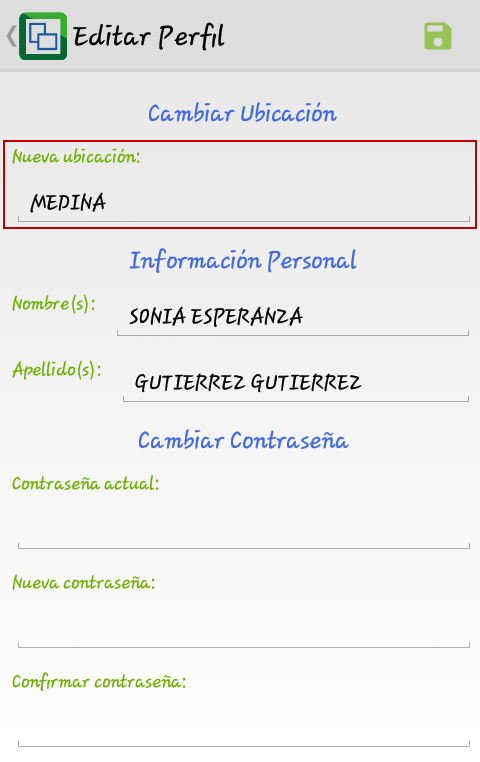
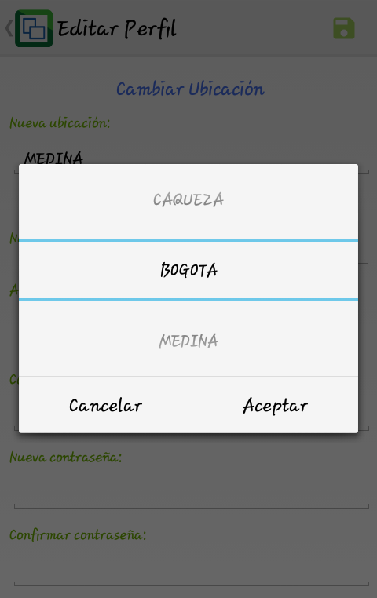
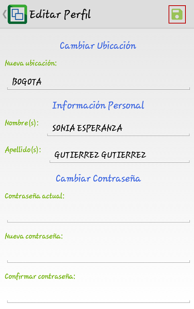
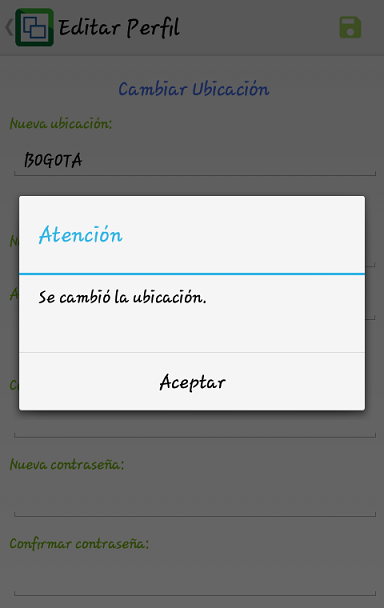
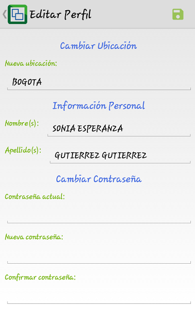

# Confirmación Ubicación Venta Tiquetes

Para realizar la confirmación de la ubicación desde donde se realiza la venta de tiquetes o donde se están generando las facturas, ingresamos a la aplicación Movil OasisCom con el usuario y clave.  

Una vez ingresemos a la aplicación, en la parte superior izquierda damos click en _Inicio_, allí nos dejará ver el nombre de la empresa, el nombre del usuario activo en el momento y algunas aplicaciones a las que tiene acceso. Seguidamente, ingresamos al botón de _Configuración_  

En configuración, ingresaremos a la opción _Perfil de Usuario_.  

La aplicación nos mostrará la ubicación que actualmente está configurada.  

Para cambiarla, damos click sobre el nombre de la ubicación actual y seleccionamos de la lista la ubicación a la cual se desea configurar, damos click en _Aceptar_.  

Seleccionada la ubicación, guardamos los cambios dando click en el botón  ubicado en la parte superior derecha.  

Al guardar, la aplicación arrojará un mensaje de control indicando que la ubicación ha sido cambiada.  

Al dar click en Aceptar, el usuario deberá volver a ingresar sus credenciales y validar el cambio de ubicación nuevamente.  

