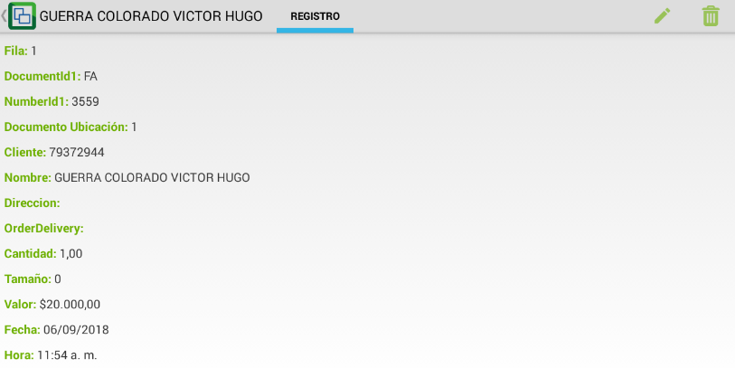

# DFLE - Fletes

La aplicación **DFLE - Fletes** permite ver la cantiadad total de tiquetes vendidos por cada vehículo en el día, el valor de cada uno y el valor total.  

Este documento se genera una vez se haya vendido el total de tiquetes disponibles para un vehículo o en el momento de despachar el mismo.  

Ingresamos a la aplicación DFLE.  

La aplicación arrojará los vehículos con ruta en el día de consulta. Allí seleccionaremos el bus del cual se desea imprimir el totalizado de ventas.  

Al dar click en la pestaña _Detalle_ veremos  el total de tiquetes vendidos para ese vehículo. Al ingresar a cada tiquete, se desglosará la información detallada de la venta.  

Verificados los tiquetes vendidos, nos dirigimos a la pestaña _Registro_ y procesamos el documento dando click en el botón .  

Procesado el documento, lo imprimimos dando click en el botón .  

