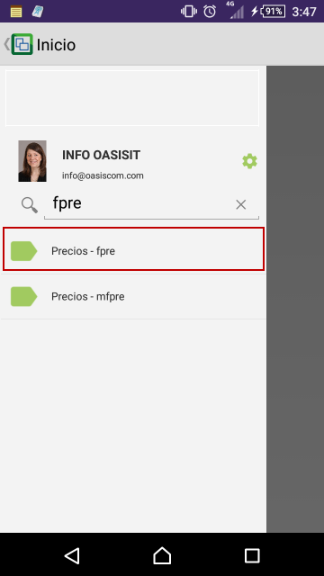
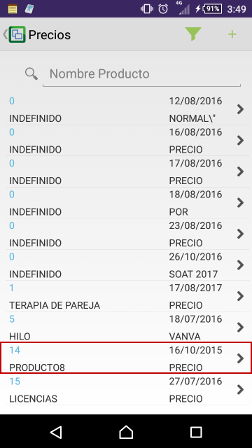
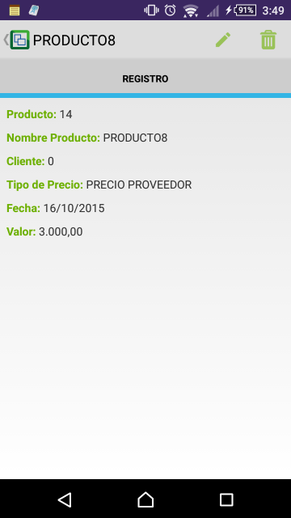
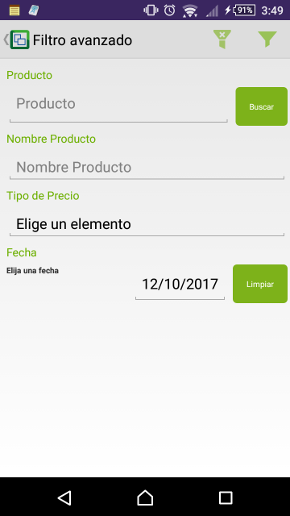
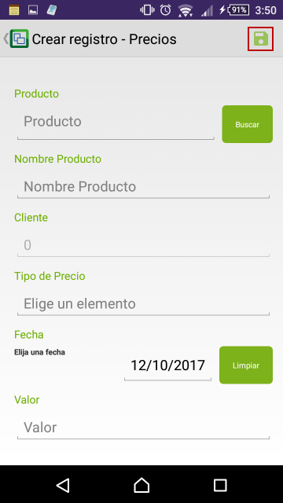

# FPRE - Precios

La aplicación **FPRE** permite asignar precios a los productos existentes en OasisCom.  

Buscamos la aplicación **FPRE** en la aplicacipon móvil de OasisCom y accedemos.  

Al ingresar podremos ver todos los productos registrados en el sistema que tienen asociado un precio.  

La aplicación **FPRE** permite realizar un filtro avanzado mediante el símbolo  con el fin de facilitar la búsqueda de productos que tienen asociado un precio.  

Allí ingresaremos los datos por los cuales deseamos filtrar y damos click en el botón 

Para asociar precio a un producto, damos click en el botón  y diligenciamos los campos.  

Finalmente, damos click en el botón  para guardar la información.  
