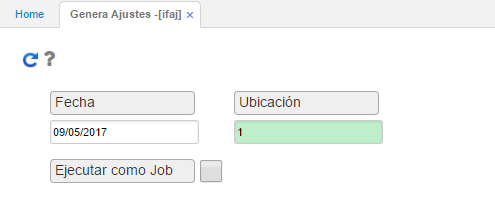

# Genera Ajustes  

La aplicación IFAJ, permite generar los ajustes correspondientes al inventario realizad,o de acuerdo con las diferencias encontradas anteriormente al ejecutar la aplicación IFCD- Calcula Diferencias.
Estos ajustes son generados en estado Activo en la aplicación IMOV- Movimiento de inventarios; por lo cual, deben ser procesados tanto las entradas por ajuste como las salidas según corresponda.
Para la generación de este proceso, se ingresará la fecha en la cual se realizó el inventario y la ubicación donde se encuentran los artículos inventariados.

Ingresados los datos, damos click en el botón Generar ; el sistema arrojará un mensaje de control indicando que el proceso se generó satisfactoriamente.

