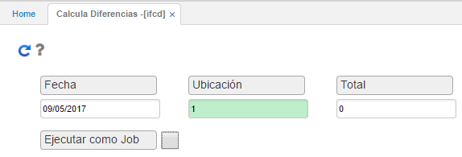
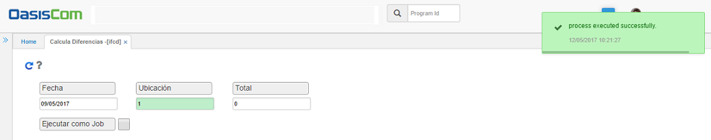

# Calcula diferencias

En el proceso de cálculo de diferencias, el sistema toma los registros de conteos y los comprara con el saldo del inventario.
Se ingresarán los datos de fecha y ubicación.

**Fecha:** ingresar la fecha en la que se realizó el inventario físico.
**Ubicación:** seleccionar la ubicación en la que se encuentran los productos inventariados.
**Total:** ingresar el número 0.

Ingresados los datos, damos click en el botón Generar   y el sistema arrojará un mensaje de control informando que el proceso fue ejecutado satisfactoriamente.

