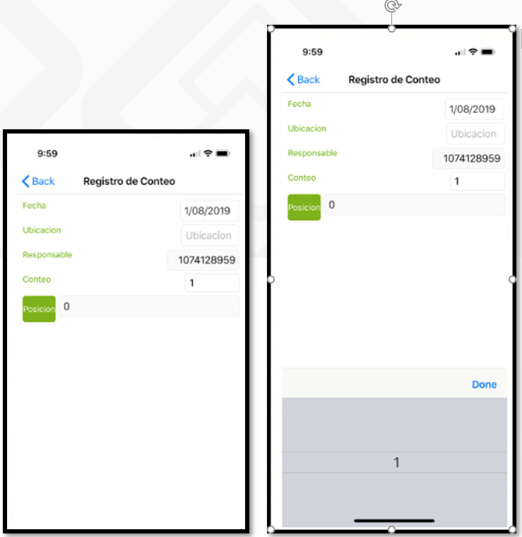

# Registro de conteos  

En esta aplicación IFIS se deberá realizar la asignación del responsable o del usuario que va a realizar el conteo de los productos.  

Se puede realizar la asignación del tercero uno a uno o masivamente.
Para hacerlo uno a uno, a cada producto en el campo ID Responsable se debe colocar el número de documento del tercero que va a contar ese producto.
Para hacer la asignación del responsable masivamente se debe realizar de la siguiente manera.

•	Se seleccionan los registros que se desean actualizar masivamente.

Damos Clic en el botón de actualiza responsable.  

Al dar clic en este botón, nos abrirá la siguiente ventana:

![](ifis4.png]

Nos vamos a la parte inferior de esta ventana donde se encuentra el campo Responsable.

Marcamos el Flag de modificar.

Cuando lo marcamos, nos habilita el campo de responsable. En este camp,o colocamos la cédula que queremos que actualice masivamente.

El sistema actualiza automáticamente la cédula a ese tercero.
En caso de que sean diferentes responsables, se deberán realizar filtros dentro de la consulta para poder asignar responsables masivamente, es decir, un responsable contará los productos de la clasificación Morrales, y otro recurso contará los productos por clasificación Billeteras.
Una vez asignado el responsable a cada producto, podemos seguir con el siguiente paso que es realizar el conteo por medio de nuestro dispositivo Móvil.

Abrimos la aplicación en nuestro celular.

•	Ingresamos nuestro usuario y clave.
•	Nos vamos a la aplicación Registro de conteos MIFIS.

Una vez ingresemos a esta aplicación, en el campo ubicación seleccionamos la ubicación que tenemos asignada.

Una vez seleccionada la ubicación, el sistema en el campo Localización nos mostrará la localización a la cual nos debemos dirigir a iniciar nuestro conteo. Para las ubicaciones que no manejan localizaciones dentro de la bodega, nos mostrará 0.

Para continuar, el sistema nos pide leer el código de barras de la localización indicada.
Para esto, debemos dac clic o tocar la pantalla de nuestro celular en el campo localización.

Esto activará la cámara de nuestro celular.
Debemos leer el código de barras de la localización; para este caso, nuestra localizacion es cero.

Una vez el sistema valide que la localización sea la correcta, mostrará el listado de productos a contar. Esto no quiere decir que estos se deban leer en el orden que el sistema muestra, se leen los productos uno a uno como se encuentren.

Para inicar el conteo, damos clic o tocamos la pantalla en el boton verde de producto para que nos active la cámara del celular.

