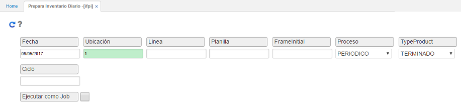
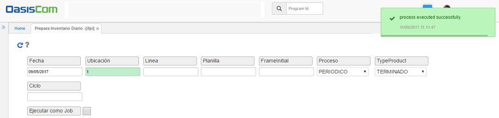

# Prepara Inventario Diario - IFPI  

Mediante la aplicación IFPI se genera la preparación del inventario a realizar. Este proceso se debe ejecutar el mismo día en que se vaya a realizar el inventario.  

•	Para ejecutar el proceso de preparación de inventario periódico ingresamos los siguientes datos:
Fecha: fecha actual en la que se va a realizar el inventario.
Ubicación: ingresar o seleccionar del zoom la ubicación (bodega) en la cual se encuentran los productos.
Línea: si el inventario se va a realizar por la línea de producto, ingresar la línea correspondiente.
Proceso: seleccionar de la lista desplegable la opción Periódico.
Tipo Producto: seleccionar de la lista desplegable la opción Terminado.

Ingresados los datos, damos click en el botón Generar   y el sistema arrojará un mensaje indicando que el proceso se realizó satisfactoriamente.

Una vez preparado el inventario físico, el siguiente paso es realizar la asignación del responsable o del usuario que va a realizar el conteo de los productos.

