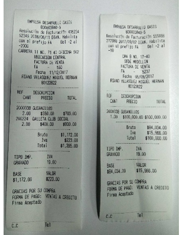

# Registro de Facturas - JFAC

En esta opción crearemos la venta del tiquete o el registro del libro del carro. En la opción _Menú_ seleccionaremos la aplicación JFAC - Facturas.  

Al ingresar a dicha aplicación, damos click o tocamos el signo **+** que se encuentra en la parte superior derecha.  

Allí se abre una nueva ventana donde podemos diligenciar los datos de nuestro tiquete.  

**Número:** Dato con el cual se conoce el tiquete en todo el sistema. La numeración se asigna automáticamente.  
**Ubicación:** Número de la ubicación en la cual se está realizando la factura. 
**Fecha:** Fecha del tiquete.  
**Cliente:** Número de identificación de la persona que realiza el tiquete.  

Después de diligenciar los datos, damos click o tocamos en el icono de _Guardar_  ubicado en la parte superior derecha para guardar nuestro registro.  

Así quedará el registro de nuestro tiquete.  

Según la fecha de nuestro tiquete, el sistema asignará automáticamente un turno, en este turno se almacenarán todos los tiquetes correspondientes a ese despachador en ese día.  

Continuando con el proceso, pasamos a la pestaña detalle y damos click para agregar los productos en ese tiquete, en este caso agregamos el valor total del viaje por vehículo (centro de costo).  

Al agregar un registro visualizaremos un formulario así:  

**Fila:** Es el renglón donde va a quedar el producto que estamos ingresando.  
**Producto:** Aquí debemos seleccionar el producto que vamos a ingresar en el detalle.  
**Cantidad:** Se diligencia la cantidad del producto, en este caso va a ser un producto por la totalidad del viaje.  
**Precio:** Aquí se diligencia en números el valor del viaje.  
**Centro de costo:** Este campo se ingresa el número del vehículo que se va a despachar, como ayuda este campo tiene un botón para buscar el número del vehículo que se va a despachar.  

Al final damos click o tocamos el botón _Guardar_ para guardar la información diligenciada.  

Y podemos observar nuestro detalle de la siguiente manera:  

Cuando ya hemos realizado tanto el registro como el detalle, volvemos a la pestaña registro y tocamos en el icono de _Confirmar_, allí nos saldrá un mensaje de confirmación.  

### [Imprimir facturas](http://docs.oasiscom.com/Operacion/movil/jfac#imprimir-facturas)

La aplicación Movil de OasisCom permite la impresión de las facturas procesadas desde dispositivos Android de la versión 4.4 en adelante, esto siempre y cuando el dispositivo se encuentre conectado a una impresora por vía blluetooth.  

Para imprimir una factura procesada damos click sobre la misma.

Para las facturas procesadas se visualizará el botón    el cual permite la impresión de las facturas.  

Al dar click en el botón  el sistema arrojará un mensaje indicando que se imprimirá la factura.  

La factura impresa se visualizará de la siguiente manera:

