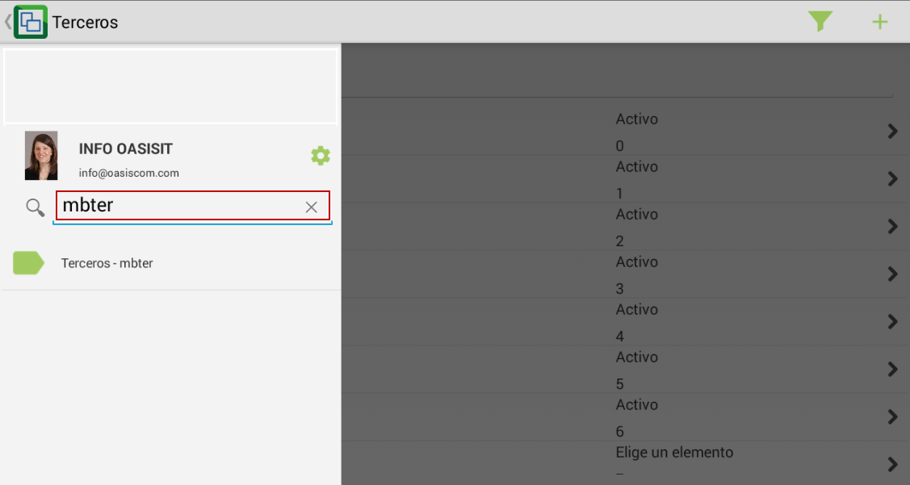
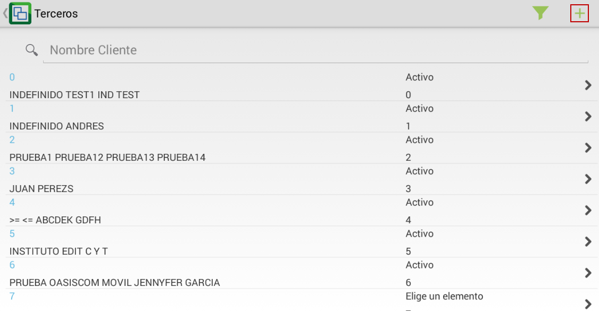

# MBTER - Terceros

La aplicación móvil MBTER permite la creación y visualización de terceros que figuran como clientes del proveedor que se encuentra logueado en la aplicación.  

Ingresamos a la aplicación y en el buscador digitamos las siglas **MBTER**.  

Al ingresar a la aplicación encontraremos la lista de todos los terceros registrados, para agregar uno nuevo, damos click en el botón .  

En la nueva ventana, diligenciaremos los datos del nuevo tercero a registrar y guardaremos los cambios dando click en el botón .  

Al guardar se visualizarán los datos del nuevo tercero registrado.  

En la parte superior derecha se visualizan los íconos de editar y eliminar respectivamente  en caso tal que se requiera actualizar la información del tercero o se desee eliminar.  

