# MIMOV - Movimientos

En esta aplicación se realizan los movimientos internos de inventarios.  

Movimiento interno de **Salida**(SA) Por **Translado**(TR)
Buscamos la aplicación **MIMOV** en la aplicacipon móvil de OasisCom y accedemos.  
  
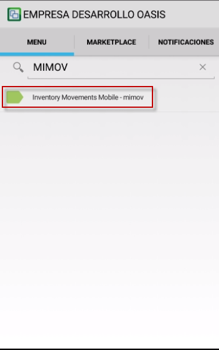

Se crea un nuevo movimiento

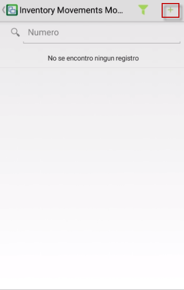

En la **Master Section** se diligencia:

- **Documento**: Tipo de movimiento que se desea realizar.
- **Concepto**: Motivo por el cual se va hacer el movimiento.

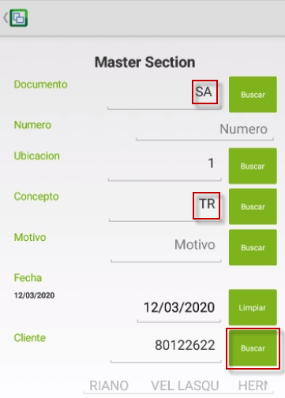

- **Cliente**: Tercero que se encarga de hacer el movimiento, puede usar el botón **Buscar**:

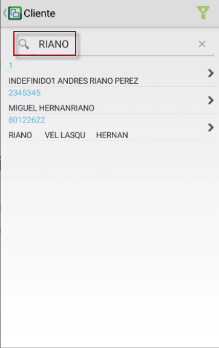

- **DestinyLocationId**: Ubicación destino a la que se va hacer el movimiento.

Una vez se terminen de diligenciar estos campos hay que dar clic en el botón continuar.

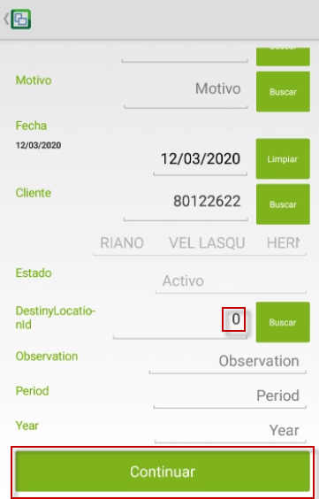

En la siguiente pantalla se ingresa el detalle del primer producto a mover, usando los botóne de la parte superiro se ingresa:

- Pos.Origen: Localización actual del producto
- Producto: Serial o id del producto a mover
- Pos. Destino: Localización nueva del producto
- Quantity: Cantidad del producto a mover

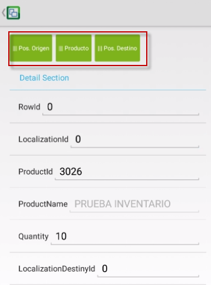

El botón **siguiente** permitirá ingresar otro producto diferente que quedará en el mismo movimiento.

El botón **Terminar Movimiento** validará los datos y procesará el movimiento si los datos ingresados son correctos.

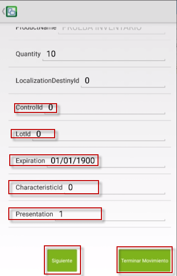

Si el proceso se realiza satisfactoriamente aparecerá el siguiente mensaje:

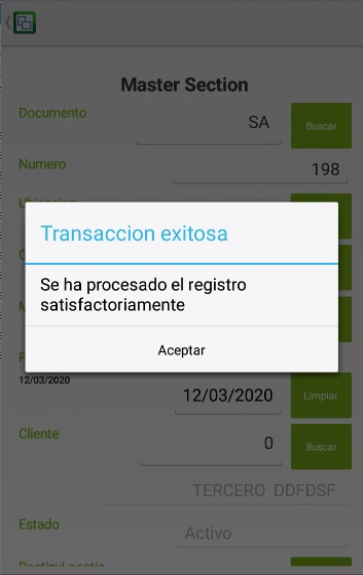

Para revisar el movimiento, seleccione el registro en el listado:

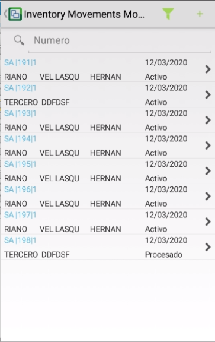

- En la pestaña **REGISTRO** se encuentran los datos generales del movimiento

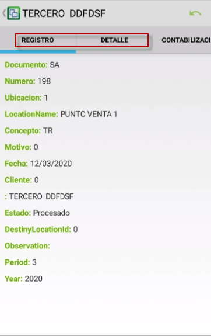

- En la pestaña **DETALLE** se encuentran los datos generales del movimiento

Para ver el detalle de cada producto seleccionelo de la lista
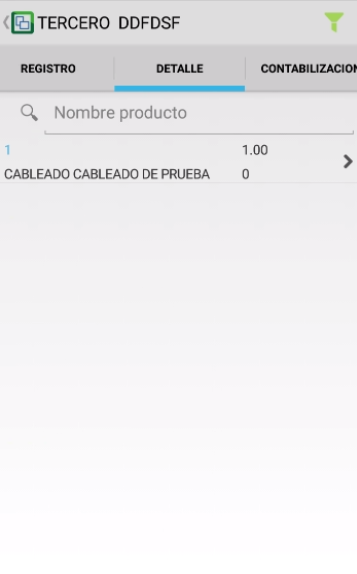

Aparecerá la siguiente ventana con los detalles del movimiento del producto seleccionado

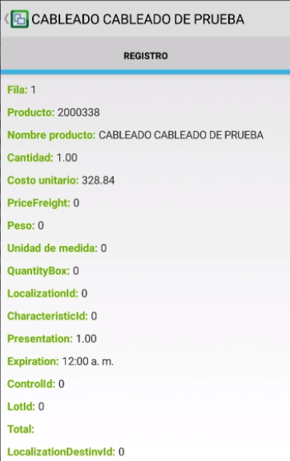