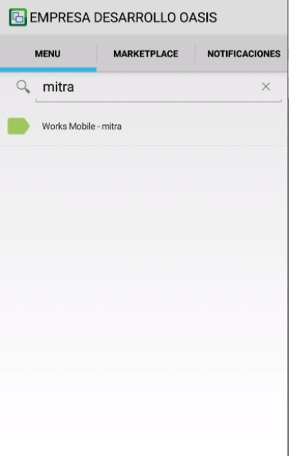
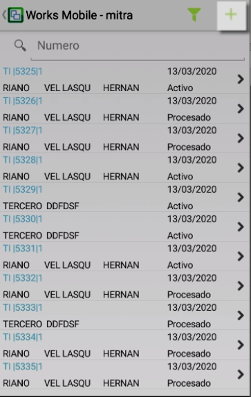
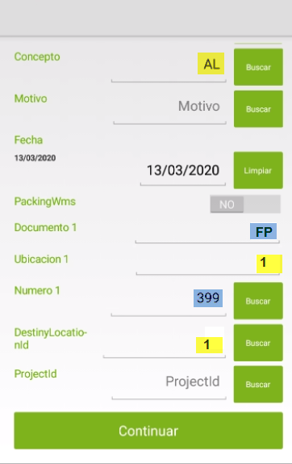
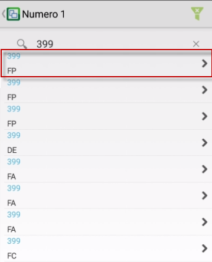
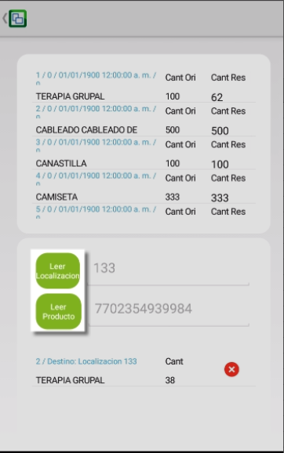
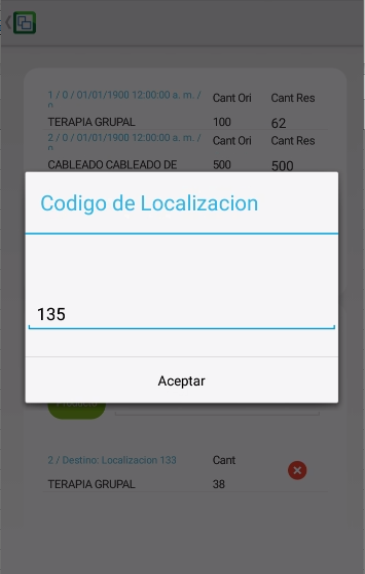
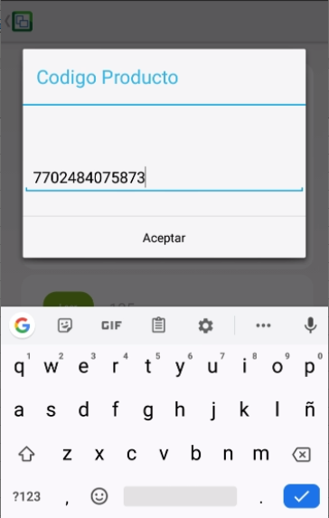
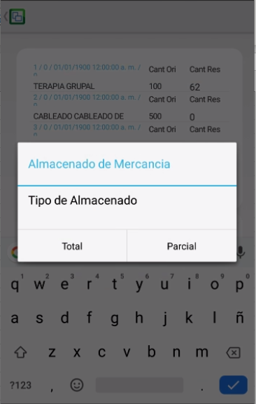
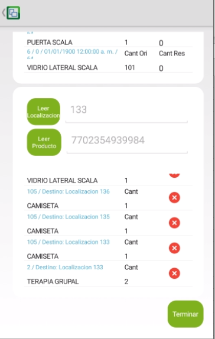
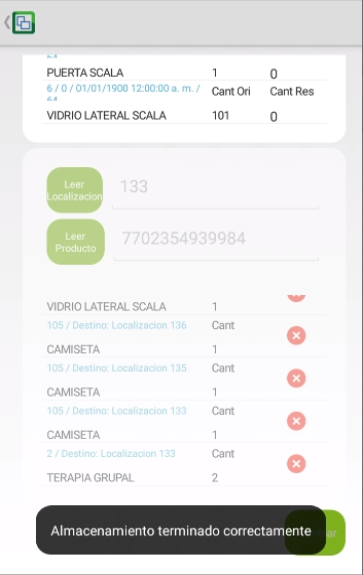

# MITRA - Almacenamiento

En esta aplicación se realizan los movimientos como el de almacenamiento.

Para este tipo de movimiento se debe contar primero con una Orden de compra y una factura de compra que referencie la orden anterior mencionada, para los procesos anteriores consultar:

- [Orden de Compra-OORD](http://docs.oasiscom.com/Operacion/scm/compras/oorden/oord)
- [Factura de Compra-OFAC](http://docs.oasiscom.com/Operacion/scm/compras/ofactura/ofac)

Buscamos la aplicación **MITRA** en la aplicacipon móvil de OasisCom y accedemos. 

Creamos un nuevo movimiento

En este caso se realiza movimiento interno de **almacenamiento**(AL) Por **Factura de Compra**(FP).

Ingresamos **Ubicación 1**, la cual hace referencia a la ubicación en la que se va a almacenar la mercancia.

En **Numero 1** Damos clic al botón **Buscar**

Digitamos el número de **Factura de Compra** creada anteriormente para este
movimiento y seleccionamos la factura correspondiente.

Se mostrará el listado de productos relacionados en la **Factura de Compra** indicada  anteriormente.

Usamos los botones de **Leer Localización** y **Leer producto** para escanear los códigos de barras o digitar los números correspondientes.

Indicamos la localización a ubicar el producto

Indicamos el producto para hacer el ingreso, este debe ser parte de la **Factura de Compra** con la que se creo el movimiento.

Si el código es correcto se mostrara la siguiente pantalla con 2 opciones:

- **Total**: ingresa la cantidad total de este producto para hacer el movimiento en la localización ya indicada
- **Parcial**: solicita una cantidad a ingresar en la localización indicada anteriormente

Una vez ingresada la totailidad de las cantidades relacionadas en **La Factura de Compra** se da clic en el botón **Terminar**

si los datos son correctos aparecerá el mensaje **Almacenamiento terminado correctamente**

