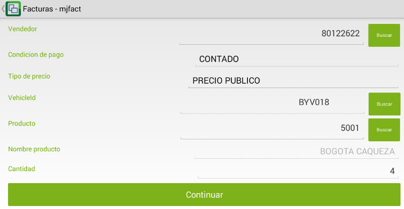
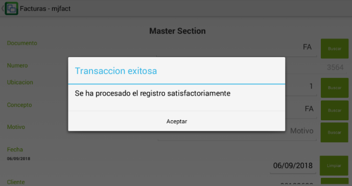

# Facturación de Tiquetes de Transporte - MJFACT

La aplicación **MJFACT** permite generar la facturación de los tiquetes para las rutas de transporte.  

En OasisCom Móvil ingresamos a la aplicación MJFACT.  

En la aplicación damos click en el botón  para generar un nuevo tiquete de viaje.  

En el nuevo tiquete, verificaremos los siguientes datos:  

**Documento:** verificar que el documento sea _FA_ correspondiente a factura.  
**Número:** el número del tiquete será asignado automáticamente por el sistema al momento de procesar el documento.  
**Ubicación:** seleccionar la ubicación desde donde se está generando el tiquete.  
**Concepto:** verificar el concepto _FA_.  
**Fecha:** seleccionar la fecha en la cual se genera el tiquete.  

**Cliente:** ingresar el número de identificación del cliente o dar click en el botón _buscar_ en caso de que ya se encuentre registrado.  
**Vendedor:** ingresar el número de identificación del vendedor.  
**Condición de pago:** seleccionar la forma en cómo se pagará el tiquete.  

**Tipo de precio:**  seleccionar el tipo de precio que le aplica al cliente.  

**Id Vehículo:** ingresar la placa del vehículo correspondiente a la ruta de viaje del tiquete o ingresar al botón _buscar_ y seleccionarlo de la lista.  

**Producto:** ingresamos al botón _buscar_ y seleccionamos la ruta de viaje o el origen de destino, aquí podremos ver el valor del tiquete.  

Finalmente, ingresamos la cantidad de pasajes que desea comprar el cliente y damos click en _Continuar_.  

El sistema arrojará un mensaje de control informando que el tiquete está procesado y enviará directamente a imprimir la colilla.  

**Nota:** una vez se hayan vendido la totalidad de tiquetes del vehículo

