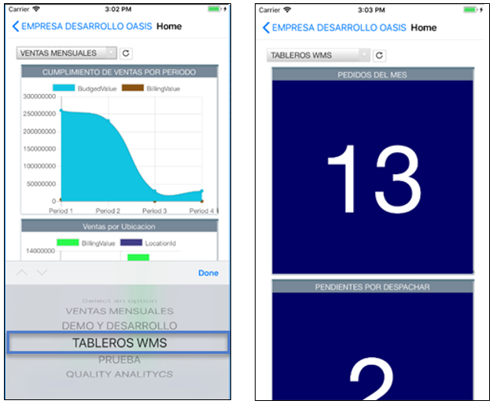
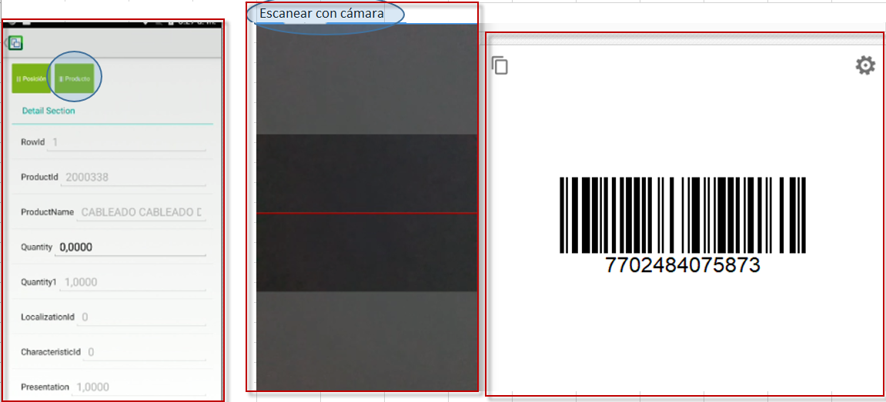

# Móvil

## [Apariencia de OasisCom Móvil](http://docs.oasiscom.com/Operacion/movil/#apariencia-de-oasiscom-móvil)

OasisCom Móvil ofrece una nueva presentación en su interfaz gráfica, mostrando en pestañas las diferentes opciones de la aplicación. El logo de la empresa y el nombre del usuario serán visibles en la pestaña _Configuración_.  

Para el sistema Android el menú se visualiza en la parte superior.  

Para el sistema IOS el menú se visualiza en la parte inferior de la pantalla.  

Pestaña _Configuración_.  

## [Registro en OasisCom Móvil](http://docs.oasiscom.com/Operacion/movil/#registro-en-oasiscom-móvil)

Ahora los usuarios podrán realizar su proceso de registro a OasisCom desde dispositivos móviles similar a la versión web. Esta funcionalidad se encuentra disponible para Android desde la versión 4.3 e IOS para las versiones 10.3 y 11.  

Ingresamos a la aplicación móvil y accedemos al botón _Registrarse_.  

Allí debemos diligenciar el formulario de registro.  

Al diligenciar el formulario y dar click en el botón _Registro_, la aplicación mostrará una alerta indicando al usuario que debe revisar su correo para culminar con el proceso de registro.  

Si el usuario ingresa información erronea o deja campos sin diligenciar, el sistema validará y arrojará mensajes de control.  

## [Ingreso a la aplicación mediante Facebook](http://docs.oasiscom.com/Operacion/movil/#ingreso-a-la-aplicación-mediante-facebook)

Los usuarios podrán iniciar sesión con faceboook a OasisCom desde cualquier dispositivo móvil. Función disponible en versiones Android desde la 4.3.1. y IOS desde la versión 9.3.  

La aplicación solicitará las credenciales de usuario correspondientes.  

La sesión será iniciada.  

## [Ingreso a la aplicación Móvil](http://docs.oasiscom.com/Operacion/movil/#ingreso-a-la-aplicación-móvil)

Ingresar usuario y clave en la aplicación OASISCOM MOVIL.

Una vez ingresemos a la aplicación, en la parte superior izquierda encontramos el Menú. Al ingresar al menú, este nos mostrará las opciones a las cuales tenemos acceso.  

Al hacer click o tocar en _Menú_ se desplegrá una ventana como la siguiente con las aplicaciones disponibles:  

## [Tableros de Control](http://docs.oasiscom.com/Operacion/movil/#tableros-de-control)

La versión móvil de OasisCom cuenta con la funcionalidad de tableros de control para la visualización de indicadores al igual que en la versión web.  

**Para sistemas operativos _Android_**

Haciendo click en el menú _Home_ se podrán visualizar los tableros de control:  

En el menú desplegable superior, se podrán elegir las opciones disponibles y así mismo el tablero se visualizará:  

Los tableros son dinámicos, por lo que permiten seleccionar el tipo de información de datos específicos haciendo click en ella. Esto aplica tanto para sistema operativo Android como para IOS.  

Si se desea recargar el tablero, en caso de que se haya actualizado información, el botón  cumple con dicha funcionalidad.  

**Para sistemas operativos _IOS_**

Haciendo click en el menú _Home_ se podrán visualizar los tableros de control:  

En el menú desplegable superior, se podrán elegir las opciones disponibles y así mismo el tablero se visualizará:  

## [Editar Perfil de Usuario](http://docs.oasiscom.com/Operacion/movil/movil#editar-perfil-de-usuario)

En la opción _Editar Perfil de Usuario_, el usuario tendrá la posibilidad de cambiar su ubicación, su nombre y la contraseña, igualmente, se debe tener en cuenta que al realizar una modificación al perfil, la aplicación cerrará sesión con elf in de guardar los cambios.  

Para realizar alguno de estos cambios, damos click en el botón  y seleccionamos la opción _Editar Perfil de Usuario_.  

A continuación, se podrá realizar los cambios de perfil que requiera el usuario y guardarlos dando click en el botón .  

## [Cambiar Empresa](http://docs.oasiscom.com/Operacion/#cambiar-empresa)

OasisCom Móvil permite realizar cambio de empresa en caso de que el usuario tenga acceso a distintas organizaciones.  

Para hacer el cambio de empresa se debe dar click en el botón  y seleccionar la opción _Cambiar empresa_.  

Al ingresar a esta opción, el usuario tendrá la posibilidad de visualizar las empresas a las que se encuentra asociado y realizar el respectivo cambio. Se debe tener en cuenta que al realizar una modificación al perfil, la aplicación cerrará sesión con elf in de guardar los cambios.  

## [Acerca de ](http://docs.oasiscom.com/Operacion/movil/#acerca-de) 

La opción **Acerca de** mostrará la información referente a la aplicación móvil.  

  

  

## [Consulta de precios](http://docs.oasiscom.com/Operacion/movil/#consulta-de-precios)  

Se debe de parametrizar el Perfil desde web:  
En el detalle del perfil, se inserta el código del usuario, el campo tipo como: favorito y en programa= [MFCPR].  

  

* Al abrir desde el móvil la visualización es la siguiente.  

  

* Realizando la consulta con el lector del código de barras, retorna la información del producto.   

  

## [Recoleccion Inventarios OasisCom Móvil](http://docs.oasiscom.com/Operacion/movil/#recoleccion-inventarios-oasiscom-movil)   

##Movil con camara.  

Esta funcionalidad esta diseñada inicialmente para el MITRA e IMOV (inventarios).  
Parametrizar en preferencias, habilitar (si) **"usar camara en scanner".**

  

Posterior, realiza el ingreso a la opcion **MITRA:**  

  

Adiciona un nuevo pedido **VPED** o en su defecto si ya los creo. Realiza la consulta del mismo.   

  

Realiza el scanneo de la posicion:   

  
Para el siguiente ejemplo se realiza el scanneo para la posicion cero (0).  

  
En la pestaña producto, realiza el scanneo:  

  
Para el siguiente escenario existe una pagina que permite consultar, gener los codigos de barras gratuito:  
https://barcode.tec-it.com/es/?data=7702484075873  

  

  
Finalizando el proceso de scanneo con camara.  

##Movil con Lector.##   

Parametrizar en preferencias, habilitar (si) **"usar camara en scanner".**   

  

Posterior, realiza el ingreso a la opcion **MITRA:**  
  

Adiciona un nuevo pedido **VPED** o en su defecto si ya los creo. Realiza la consulta del mismo.   

  

Realiza el scanneo de la posicion:   
  

En la pestaña producto, realiza el scanneo:  

  

Finalizando el proceso de piking.  

  

