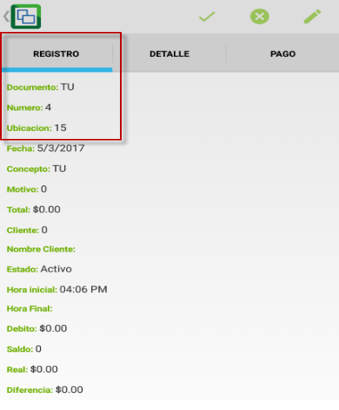
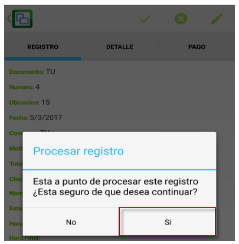

# Turnos

Para revisar cuanto facturó el despachador en su turno, ingresamos a revisar el turno en la aplicación JTUR - Turnos, nos dirigimos al menú y seleccionamos la opción.  

En la pestaña registro podemos observar que se creó un turno, a nivel del detalle podemos visualizar, las facturas que están asociadas a ese turno y por el valor que se realizaron.  

Al final del día o cuando ya se haya terminado la facturación, se debe procesar el turno.  

