# Comprar

La aplicación _Comprar_ permite realizar pedidos de productos y/o servicios por proveedor. La aplicación realiza la agrupación de productos según su clasificación.  

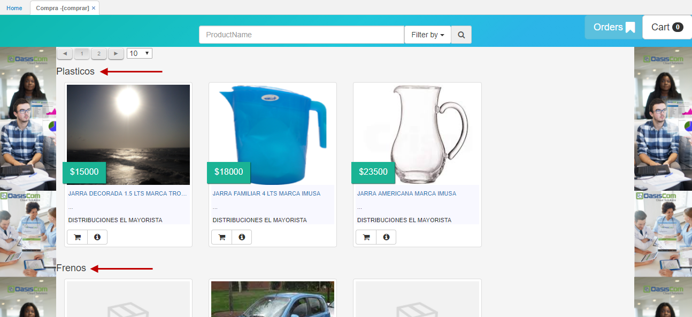

Es posible filtrar por la categoría de productos deseada.  

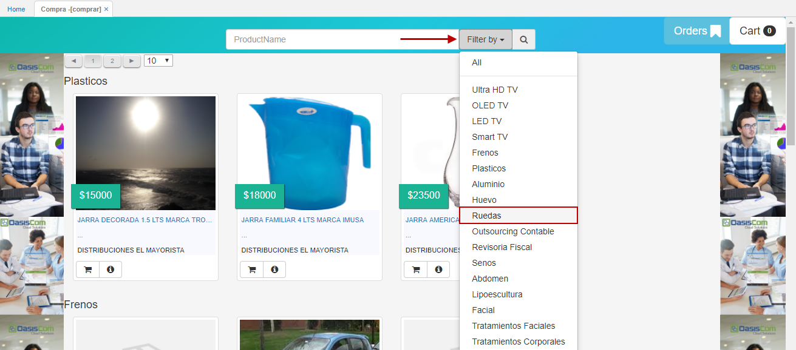

#### Filtro por código de barras

Oasiscom permite al usuario realizar la búsqueda de productos por medio de lectura de código de barras, esto con previa parametrización de la opción [**BPRO - Básico Productos**](http://docs.oasiscom.com/Operacion/common/bprodu/bpro) en los campos _'Ean'_, _'EanChar'_ y _'OldCode'_.  

Para el ejemplo utilizaremos el producto 2002624 el cual tiene en el campo EAN 22222.  

**BPRO - Básico de Productos**

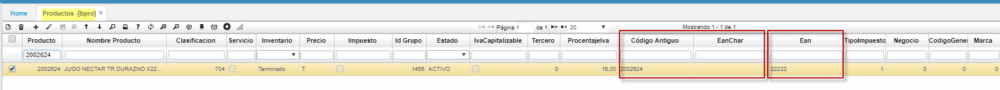

* Se agrega en la lista de filtros de productos, el filtro por Código de Barras (CodeBar), el cual seleccionamos y nos posicionamos en el campo, de ProductName, donde con la pistola detecta este código y realizara la respectiva búsqueda.  

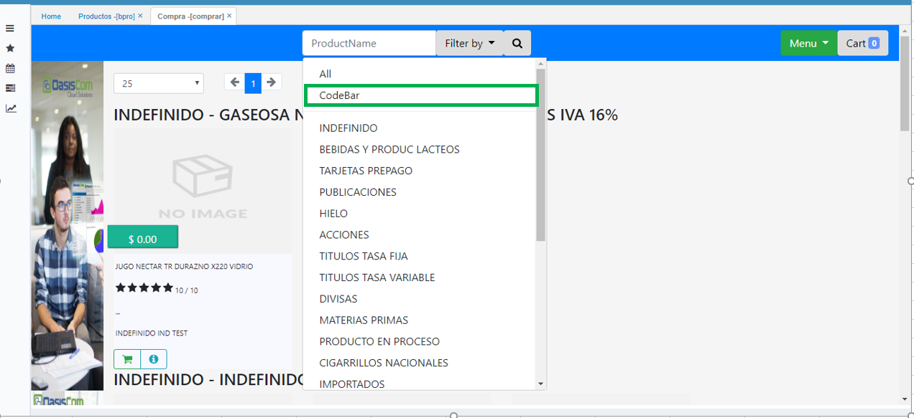

* El sistema no necesita indicarle la clasificación, pues el producto es único y por ello el código EAN también debe ser único.  

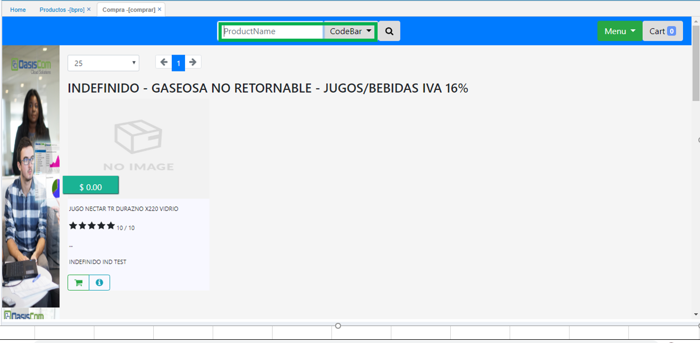

* En el botón de Menú, en la opción de Orders, donde la consulta muestra únicamente los que sean de la opción VPED y que no estén Anulados.  

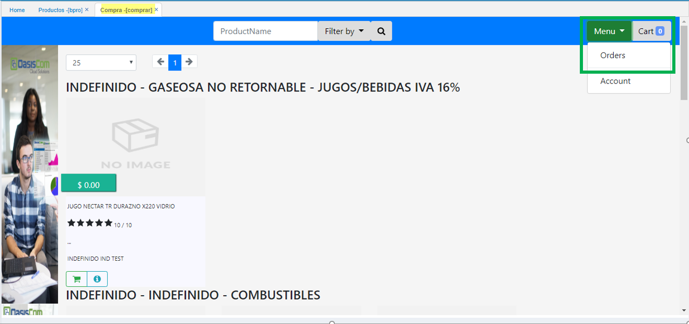

* Las Ordenes se detallarán con: Documento, Número, Fecha y se descripción en el Detalle: producto, precio, cantidad.  

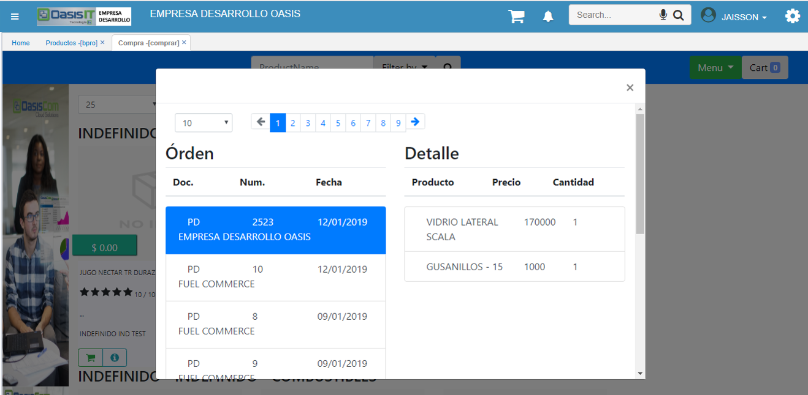

#### Para realizar un pedido  

Para realizar un pedido, seleccionamos los productos dando click en el botón  y estos se irán agregando al carrito de compras que se encuentra a la derecha de la ventana.  

Seleccionados los productos y/o servicios, ingresamos al carrito de compras a confirmar el pedido dando click en el botón **Order**.  

Confirmado el pedido, el sistema arrojará un mensaje de control indicando que el pedido se ha realizado satisfactoriamente.  

Los pedidos realizados podrán ser vistos en la aplicación **MOORD - My Orders**.

# [Pestaña _Mis Ordenes_](http://docs.oasiscom.com/Operacion/mpportal/mpcliente/comprar#pestaña-mis-ordenes)

La aplicación **Comprar** cuenta con la pestaña _Orders_ ubicada en la parte superior derecha de la ventana, la cual permite la visualización de las ordenes realizadas en la aplicación **MOORD - My Orders** del tercero que se encuentre actualmente logueado en la aplicación.  

Al acceder a la pestaña _Orders_, podremos ver los pedidos que el usuario ha realizado por medio de la aplicación **MOORD - My Orders** y el proveedor al cual se le realizó dicho pedido, y al seleccionar un documento de la columna izquierda se verá en detalle los productos que comprenden dicho pedido.  

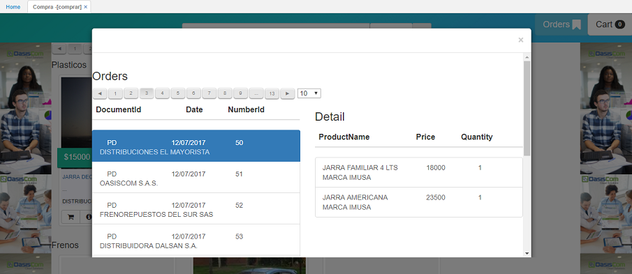

# [Opción _Mi Cuenta_](http://docs.oasiscom.com/Operacion/mpportal/mpcliente/comprar#opción-mi-cuenta)

La aplicación _Comprar_ del MarketPlace cuenta con la opción Mi Cuenta:  

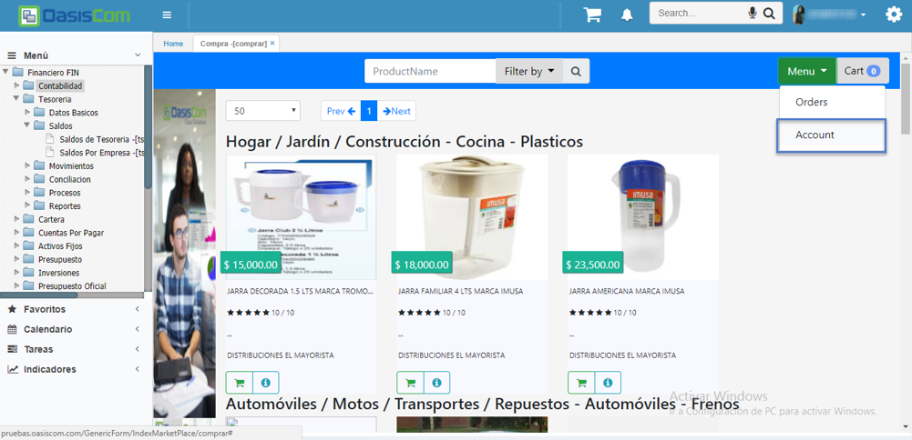

Al seleccionar la opción, se desplegará la siguiente ventana, la cual permitirá la administración de la cuenta de esta opción (tercero):  

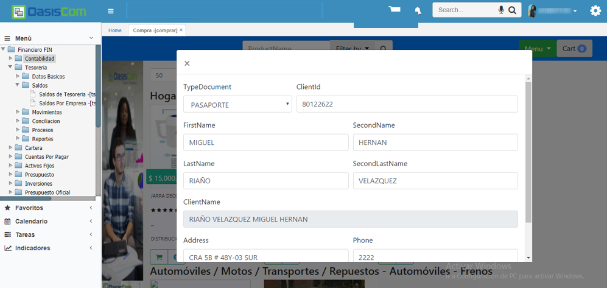

La información que aquí se modifique, se verá reflejada en la opción [**BTER - Terceros**](http://docs.oasiscom.com/Operacion/common/btercer/bter) y [**SUSU - Usuarios**](http://docs.oasiscom.com/Operacion/system/sacceso/susu) de la empresa 23 (MarketPlace).  

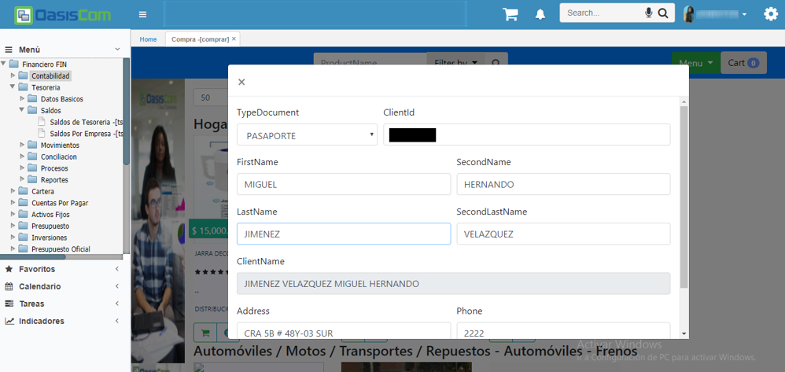

En la aplicación [**BTER - Terceros**](http://docs.oasiscom.com/Operacion/common/btercer/bter) se verán los nuevos datos ingresados en el formulario anterior.  

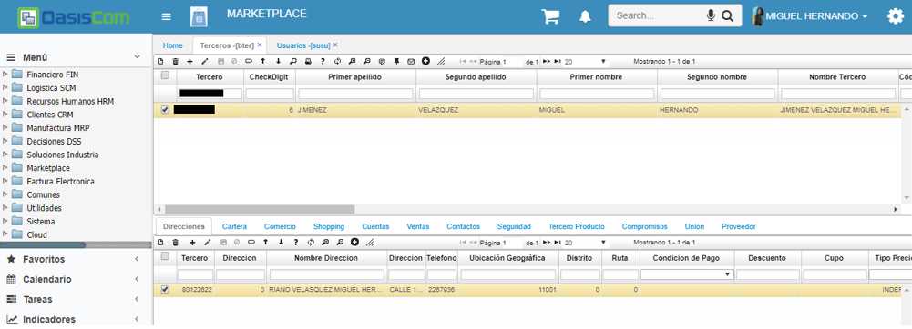

En la aplicación [**SUSU - Usuarios**](http://docs.oasiscom.com/Operacion/system/sacceso/susu) se reemplazarán los datos del usuario que estaba en sesión en el momento por los datos ingresados en el formulario.  

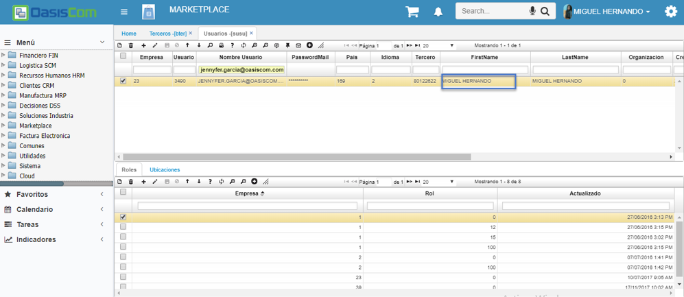

En el nombre del perfil también se verá reflejado el cambio, puesto que, en la opción [**SUSU - Usuarios**](http://docs.oasiscom.com/Operacion/system/sacceso/susu), se tiene asociado este tercero en el usuario logueado.  

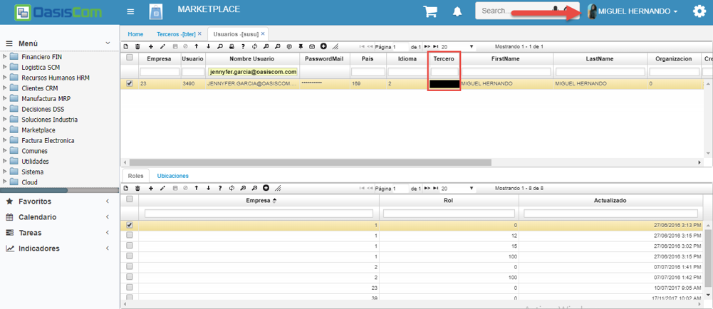

Si en la opción [**SUSU - Usuarios**](http://docs.oasiscom.com/Operacion/system/sacceso/susu) se tiene un usuario el cual no contiene cuenta, al abrir la opción _Mi Cuenta_, mostrará los campos en blanco para su respectiva creación:  

