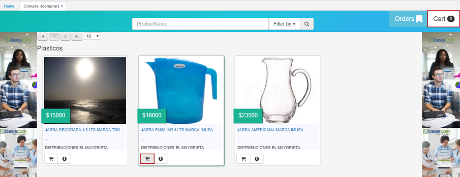

# Comprar

La aplicación _Comprar_ permite realizar pedidos de productos y/o servicios por proveedor.

Seleccionamos los productos dando click en el botón  y estos se irán agregando al carrito de compras que se encuentra a la derecha de la ventana.  

Seleccionados los productos y/o servicios, ingresamos al carrito de compras a confirmar el pedido dando click en el botón **Order**.  

Confirmado el pedido, el sistema arrojará un mensaje de control indicando que el pedido se ha realizado satisfactoriamente.  

Los pedidos realizados podrán ser vistos en la aplicación [**MOORD - My Orders**](http://docs.oasiscom.com/Operacion/mpportal/mpcliente/moord).

# [Pestaña _Mis Ordenes_](http://docs.oasiscom.com/Operacion/mpportal/mpcliente/comprar#pestaña-_-mis-ordenes-_-)

La aplicación **Comprar** cuenta con la pestaña _Orders_ ubicada en la parte superior derecha de la ventana, la cual permite la visualización de las ordenes realizadas en la aplicación [**MOORD - My Orders**](http://docs.oasiscom.com/Operacion/mpportal/mpcliente/moord) del tercero que se encuentre actualmente logueado en la aplicación.  

Al acceder a la pestaña _Orders_, podremos ver los pedidos que el usuario ha realizado por medio de la aplicación [**MOORD - My Orders**](http://docs.oasiscom.com/Operacion/mpportal/mpcliente/moord) y al seleccionar un documento de la columna izquierda se verá en detalle los productos que comprenden dicho pedido.  

